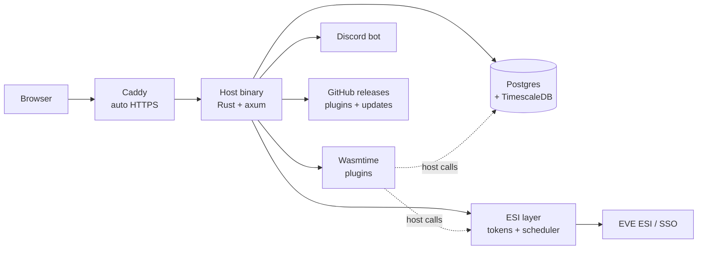
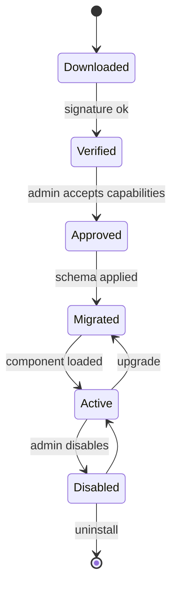

# Architecture

A single Rust binary renders the web UI on the server, runs the ESI scheduler and job workers, and hosts plugins in a Wasmtime sandbox. Postgres is the only required dependency. If this file conflicts with `docs/PRD.md`, the PRD wins.

## Overview



Plugins reach ESI, storage and Discord only through host functions, never directly.

| Component | Role | Tech |
| --- | --- | --- |
| Host binary | HTTP API, auth, admin, plugin lifecycle | Rust, axum, tokio, sqlx |
| Plugin runtime | Runs plugin code in a sandbox | Wasmtime, component model (WIT) |
| ESI layer | Token vault, scheduling, shared cache, budgets | `eve-esi-client` crate |
| Job workers | ESI syncs and plugin background tasks | tokio tasks on a Postgres queue |
| UI | Server-rendered pages, navigation, plugin pages | askama templates, Basecoat, htmx |
| Database | Core data, per-plugin schemas, time series | Postgres 16+, TimescaleDB |
| Reverse proxy | TLS, HTTP/2; certificates from Let's Encrypt only | Caddy |

## Plugin model

Plugins are WebAssembly components installed at runtime from a GitHub repo URL or an uploaded .zip package, with no restart and no image rebuild. Each runs in its own Wasmtime instance and can only call host functions its manifest declares.

First-party plugins (Alliance Auth's apps, starting with Moon Mining) live in `plugins/`, built and tested with the workspace and packaged like any other by `scripts/package-plugin.sh` (built, zipped, minisign-signed with the publisher's key). They get no powers a third-party plugin couldn't.

**Package contents** (a .zip, published as a release asset on the plugin's GitHub repo or uploaded directly):

- `plugin.toml`: identity, version, host API version, declared capabilities and permissions
- `plugin.wasm`: the component, built against the host's WIT interfaces
- `migrations/`: SQL files for the plugin's own schema, `0001_<name>.sql` onward with no gaps
- `ui/`: optional images (PNG, JPEG, WebP, GIF) referenced by the plugin's page descriptions
- `rotation.txt` and `rotation.txt.minisig`: only when the publisher changed keys (below)
- a detached minisign signature over the whole .zip, next to it (`<package>.zip.minisig`)

Everything else in a package is refused, as are symlinks, encrypted entries, repeated names and archive comments.

```toml
[plugin]
id = "nmu.mining-ledger"          # up to 50 lowercase letters, digits, single . - _
name = "Mining ledger"
version = "0.3.1"
host_api = "1"
repository = "https://github.com/example/mining-ledger"

[publisher]
key = "RWQ..."                    # minisign public key, pinned on first install

[capabilities]
storage = true
discord = ["send_message"]
http = ["janice.e-351.com"]

[capabilities.secrets.janice_api_key]   # entered by the admin; the host sends it
host = "janice.e-351.com"                # to this declared host only,
header = "X-ApiKey"                      # in this header

[capabilities.esi]
user = []                          # scopes each user consents to
data_source = ["esi-industry.read_corporation_mining.v1"]  # characters an admin designates

[[capabilities.schedules]]
name = "sync_mining"
every = "30m"                      # fixed intervals, 5m to 7d

[permissions]
view = "View mining ledger"
manage = "Manage mining ledger"
```

Unknown fields are refused, so a typo can't hide a capability.

**Publisher keys:** the key in the first installed package is pinned for that plugin id and kept even after uninstall. A package signed by another key is refused unless it carries `rotation.txt`, the exact statement `tether-key-rotation v1`, `plugin: <id>`, `old: <pinned key>`, `new: <new key>` (one per line), signed by the pinned key. A publisher who lost their key can't rotate; an admin can re-pin the plugin's key after typing its id to confirm. Pinning, rotating and re-pinning are audited.

**Install flow:** admin pastes a repo URL (host fetches the latest release) or uploads a .zip → verifies the signature and pins the publisher key on first install → shows declared capabilities → admin approves → host applies migrations → component loads. Later updates must be signed by the pinned key or they are rejected.



Upgrades snapshot the plugin's schema first, so a failed upgrade rolls back to the previous version and data. Today the snapshot is taken whenever a plugin with applied migrations has new ones to run (which is what an upgrade does), and they don't run without it; putting the previous package back comes with the upgrade task.

**Host API** (versioned WIT interfaces, unstable until the end of milestone 3):

| Interface | What a plugin can do |
| --- | --- |
| `esi` | Request ESI data for a character or corp, within approved and consented scopes |
| `storage` | Query and write its own Postgres schema only |
| `identity` | Read the current user, characters, corp, alliance, roles |
| `jobs` | Enqueue background work and run declared schedules |
| `discord` | Send messages and read role mappings, if declared |
| `http` | HTTPS to hosts declared in the manifest and approved by the admin only; the host adds admin-entered secrets, caps and logs every request |
| `log` | Structured logs shown in the admin panel |

**Consent, three layers:**

1. Admin approves the plugin's declared capabilities at install.
2. Members consent by registering their characters with the Member state's required scopes, which include every installed plugin's user scopes (Alliance Auth style; see docs/AA_PARITY.md). Corporation data comes only from owner characters an admin approved.
3. The host checks both on every call. Plugins never see a token.

In the UI plugins are called apps, as in AA; the SDK and code keep "plugin".

**AI-friendly SDK:** WIT files are the machine-readable contract. The plugin template ships an `AGENTS.md` describing the SDK, capabilities and patterns, plus complete example plugins. `platform plugin dev` runs against mock ESI with hot reload. Errors are actionable: a call outside declared scopes names the exact manifest entry to add.

**Resource limits:** Wasmtime fuel or epoch interruption plus a memory cap per plugin. Each plugin's database role has a `statement_timeout`.

## ESI layer

The host is the only thing that talks to ESI. It owns every token, schedules every sync, and fetches each piece of data once however many plugins want it.

- **Token vault:** refresh tokens encrypted at rest with a key from the environment; access tokens cached in memory and refreshed before expiry; each token records its granted scopes; `invalid_grant` marks the token revoked and prompts the user to re-link.
- **Scheduler:** next fetch comes from the `Expires` header; conditional requests with `ETag` / `If-None-Match`; identical requests from different plugins are merged and served from a shared cache; interactive requests jump ahead of bulk syncs.
- **Budgets:** tracks ESI error-limit and rate-limit headers and slows down before hitting them; per-plugin shares, so one misbehaving plugin is throttled and flagged instead of getting the whole instance blocked.
- **User-Agent:** includes the admin contact, set once at the host level.

## Storage and jobs

Postgres holds everything, including the job queue.

- `core` schema: users, characters, tokens, corps, alliances, states, groups, permissions, audit log.
- `plugin_<id>` schemas: one per plugin with `storage = true`, owned by Tether's role. The plugin's own login role (random password, sealed in `core.secrets`) can use and create objects only there: no rights on `core`, `public` or other plugins' schemas, no temporary tables, no advisory locks. The host reaches it through a small pool per plugin, and sets timeouts, memory and `search_path` before every statement, since a role can change its own defaults. Uninstalling drops the schema and role.
- TimescaleDB hypertables are for Tether's own time series for now: plugin roles have no access to `public`, where TimescaleDB's functions live. If a plugin needs one, the host can offer it through a host call.
- `esi_cache`: shared cached responses with expiry, host-only.
- Job queue: a `jobs` table polled with `SELECT … FOR UPDATE SKIP LOCKED`; exponential backoff; dead-letter state; visible in the admin panel. Workers are tokio tasks inside the host; the count is a config value.
- Core migrations are embedded in the binary and run on startup. Plugin migrations run on install and upgrade, each in its own transaction as the plugin's role, recorded with a checksum so an applied one can't change; upgrades take a snapshot first.
- Snapshots (`tether-snapshots`, N14): `pg_dump --format=custom` of one kind, streamed through encryption to the snapshots volume (`SNAPSHOT_DIR`, `/var/lib/tether/snapshots`). Core is the `core` schema plus the migration history (`public._sqlx_migrations`); a plugin is its `plugin_<id>` schema plus its rows in `core.plugin_migrations`. The migration records ride in the file's header, read in the same exported database snapshot as the dump. Taken at startup before pending core migrations (only when the database already has some; no snapshot, no migration: `SKIP_MIGRATION_SNAPSHOT=true` is for local development only) and before a plugin's migrations on an upgrade, into `snapshots/`, the last 5 per kind; free disk (`df`) is checked against the schema's table size plus 64 MiB first. The client tools must be Postgres 16's, like the server: the app image installs `postgresql-client-16`.
- Nightly encrypted backups reuse it: the `backups.nightly` job snapshots core and every plugin with storage into `backups/`, a week kept per kind. Copying them off the box, optionally to S3-compatible storage, is deferred to the pre-launch checklist.
- Snapshot files: magic, format, a plaintext JSON header (kind, reason, time, Tether, Postgres and TimescaleDB versions, migration records), then the dump as STREAM chunks (64 KiB; RustCrypto's `aead-stream`, BE32: a random 19-byte prefix, a 32-bit counter and a last-chunk flag per nonce) of XChaCha20-Poly1305 under a key derived from `ENCRYPTION_KEY` (HKDF-SHA-256 expand, label `tether snapshots v1`), each chunk's associated data the hash of the header, so the header can be read without the key but not changed. Chunks can't be reordered, dropped or truncated unnoticed; nothing is held whole in memory.
- `tether rollback` (with the server stopped; it refuses while the server's connections are open): by default the newest core snapshot taken before migrations, or `--plugin <id>`, or any snapshot or backup by `--snapshot <name>` (`--list` shows them). It shows the snapshot's time, warns that newer data of that kind is lost, and asks to confirm (`--yes` for scripts). It refuses a TimescaleDB version other than the snapshot's, and a plugin reinstalled since (another role). The restore reads the whole file once to check it, calls `timescaledb_pre_restore()`, runs `pg_restore`'s SQL through `psql` in a transaction committed only if the whole file opened and both tools succeeded, then `timescaledb_post_restore()` (startup also switches off a restore mode an interrupted rollback left on). Core's runs as Tether's role between `DROP SCHEMA core CASCADE` and, in the same transaction, the migration records, the end of every session (a rollback mustn't revive ones ended since), and the `snapshot.restored` audit entry with how many audit entries it discarded. A plugin's never runs as Tether's role, because its CHECK constraints, domains and generated columns call its own functions as whoever loads the data: Tether sets the schema aside and makes an empty one as `plugin_storage` does, `psql` logs in as the plugin's role (its password from the vault) to load the dump's objects without owners or grants, then Tether drops the old schema and puts the migration records back, audited in that transaction. A failure puts the old schema back, and a restore cut short is undone by the next attempt. Other kinds are never touched. Revoked permissions, tokens and blacklist entries come back with a core rollback; the prompt says so.
- A startup that fails its migrations doesn't take a new snapshot on every restart (which would push the one from before the upgrade out of the last five): the newest one is reused while the same migrations are applied and that kind hasn't run since it was taken. The server records a run in `SNAPSHOT_DIR` after migrating, and a plugin each time it loads. (Admin CLI commands run meanwhile don't count as a run: what they change after the reused snapshot is lost on rollback like anything else newer.)
- A restore holds an advisory lock: a second rollback refuses, and the server won't start until it's done. A plugin restore cut short leaves its old data in a `rollback_<hash>` schema; the plugin won't load and `doctor` warns until a rollback of it runs again, which puts that data back first. For the load, the plugin role's `temp_file_limit` is raised (to eight times the snapshot, 1 to 64 GiB) with a per-database role setting, removed afterwards, and removed when the plugin loads if a crash left it.
- Child processes (`pg_dump`, `pg_restore`, `psql`, `df`) start with an empty environment plus PATH, HOME and locale, and the `PG*` connection variables (password in `PGPASSWORD`, TLS mode from `DATABASE_URL`); they never see `ENCRYPTION_KEY` or the other secrets.

## Identity and permissions

EVE SSO is the only login. No email.

- One account holds many characters; the first linked is the main and can be changed. Alts are added by logging in with them while signed in.
- The first account to log in on a fresh install becomes the owner.
- States, Alliance Auth style: **Member**, **Blue** and **Guest** built in, plus any admins create, each with a priority and a list of alliances, corporations and characters. An account's state is the highest-priority state whose list matches its main; no match is Guest. Re-evaluated on every affiliation sync via ESI's bulk affiliation endpoint, and whenever the states change.
- Scope compliance: each state other than Guest requires scopes (Member: installed plugins' user scopes plus admin additions) on every character of the account. As in Alliance Auth, an account that falls short keeps its state but is flagged for officers and left out of compliance groups until every character is registered; a daily token check notices revoked tokens. Plugins' user-scope calls need a Member character registered with the scope. Corp Stats reads approved corporations' member lists daily to show members who never registered.
- Groups add access on top of states, with Alliance Auth's flags (Internal, Hidden, Open, Public, Restricted) and allowed states. Pilots join and leave on the Groups page; Group Leaders (and holders of `group_management`) decide requests in Group Management, and each group keeps an Audit Log. Compliance groups are Internal groups Tether fills with the compliant accounts of their allowed states. The rules live in `tether_core::groups` and `tether_web::groups`.
- Permissions come from the core and from plugin manifests, and are assigned to states or groups only. Every change is audit-logged.
- Personal access tokens with explicit scopes and expiry, for bots and scripts.

## UI

Server-rendered HTML from Rust. No JS framework, no npm, no separate frontend build. The look is defined in `docs/DESIGN.md`.

- **askama** templates, compiled into the binary and type-checked at build time.
- **Basecoat** supplies the shadcn-style components as plain CSS classes (`btn`, `card`, `input`, `table`, `tabs`). Its CSS is vendored into `assets/vendor/` and themed with the tokens from `DESIGN.md`.
- **htmx** handles interactivity without writing JavaScript: partial page swaps for tabs, filters, sorting, pagination and forms; server-sent events for live countdowns, pop alerts and job status. Server-sent events come from axum's `Sse`; the one bundled script, `assets/notifications.js`, keeps the top bar's unread count live from `/notifications/stream`, fed by Postgres `LISTEN tether_notifications` (a trigger on `core.notifications`), so notifications from jobs and the CLI arrive too.
- **Tailwind's standalone CLI** (a single binary) builds the CSS. No Node or npm anywhere.
- Fonts (Geist, Geist Mono), icons and htmx are bundled and served by the host. The browser's only external requests are to CCP's image server.
- Navigation is built from core routes plus plugin manifests, filtered by the viewer's permissions.
- A small JSON API (documented with utoipa) serves bots, scripts and personal access tokens; the UI itself uses HTML over htmx.

**Plugin pages are declarative.** A plugin returns a page description (header, stat row, tables, cards, tabs, forms, badges, charts) as structured data. The host validates it and renders it with the same templates as core pages. Every plugin looks native, and no plugin code ever runs in members' browsers. Interactive elements in a description map to host-provided htmx actions that call back into the plugin.

## Discord

Built into the host, not a plugin. REST only (twilight-http): no gateway connection. One bot serves the core and every plugin. Members with Discord access (`discord.access_discord`, a permission) join the server through OAuth linking, which adds them with their roles; after that, only ESI affiliation drives role changes, and leaving the Discord server isn't tracked. Losing access, or unlinking, removes them from the server.

- Account linking via OAuth from the Dashboard.
- Tier and group to role mappings, applied automatically as membership changes.
- Nicknames from AA's Name Formatter: a format per state, such as `[{corp_ticker}] {character_name}` (switchable off).
- Fleet ping broadcasts with channel and role targeting; plugins can send through the same path if declared.
- Role changes go through the job queue with retries.

## Deployment

Three containers: host, Postgres, Caddy. Images for amd64 and arm64.

```yaml
services:
  app:
    image: ghcr.io/<org>/alliance-platform:1
    env_file: .env
    depends_on: [db]
    restart: unless-stopped
  db:
    image: timescale/timescaledb:latest-pg16
    env_file: .env
    volumes: [pgdata:/var/lib/postgresql/data]
    restart: unless-stopped
  caddy:
    image: caddy:2
    ports: ["80:80", "443:443"]
    command: caddy reverse-proxy --from ${DOMAIN} --to app:8080
    restart: unless-stopped
volumes:
  pgdata:
```

- `.env` holds only the domain, a generated database password, a generated setup token and a generated encryption key (for tokens and secrets at rest; it never enters the database). Everything else is set in the first-run web wizard, which shows the exact EVE callback URL to register and tests it.
- The wizard's first step requires the setup token, which is also printed to the logs at startup as a fallback. Once an owner exists the wizard is disabled permanently and the token is ignored.
- `doctor` checks DNS, external reachability of 80 and 443, TLS, database, ESI credentials and callback match, and the Discord token, printing a fix for each failure.
- Upgrades: change the image tag and restart. Migrations run after an automatic snapshot; rollback is the previous tag plus that snapshot: `docker compose stop app`, `docker compose run --rm app rollback`, set the tag back, `docker compose up -d`.
- Volumes: `pgdata` (Postgres), `snapshots` (encrypted snapshots and backups, `/var/lib/tether/snapshots` in the app), and Caddy's two. Snapshots are only as safe as `ENCRYPTION_KEY`: keep a copy of it apart from the backups.
- Admin routes can be bound to a private interface such as Tailscale.

## Testing without a frontend

- OpenAPI via utoipa with Scalar at `/docs` in dev builds as a clickable test UI.
- Real SSO works with no frontend: visit `/auth/login`, the backend handles redirect and callback.
- `dev-login` feature for fixture sessions, compiled out of release builds.
- wiremock with recorded ESI fixtures, `#[sqlx::test]`, `tokio::time::pause`, insta snapshots, Hurl smoke tests.
- A staging instance on the Oracle box with real characters before anything reaches NMU.
