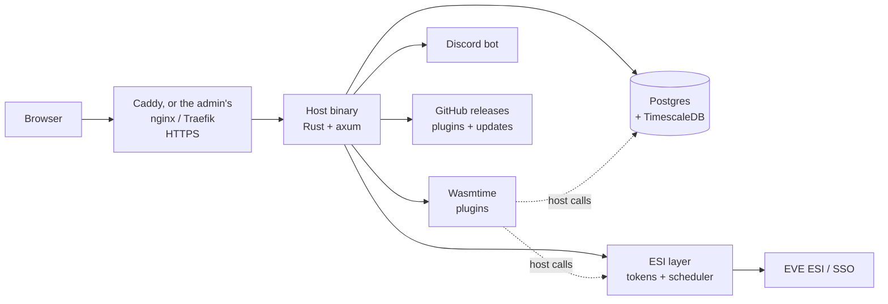
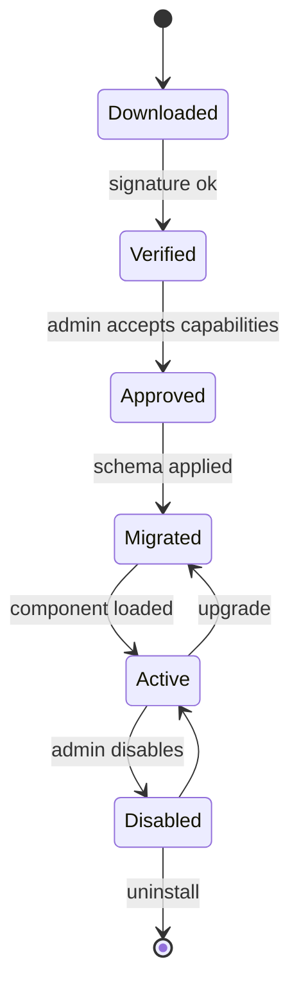

# Architecture

A single Rust binary renders the web UI on the server, runs the ESI scheduler and job workers, and hosts plugins in a Wasmtime sandbox. Postgres is the only required dependency. If this file conflicts with `docs/PRD.md`, the PRD wins.

## Overview



Plugins reach ESI, storage and Discord only through host functions, never directly.

| Component | Role | Tech |
| --- | --- | --- |
| Host binary | HTTP API, auth, admin, plugin lifecycle | Rust, axum, tokio, sqlx |
| Plugin runtime | Runs plugin code in a sandbox | Wasmtime, component model (WIT) |
| ESI layer | Token vault, scheduling, shared cache, budgets | `eve-esi-client` crate |
| Job workers | ESI syncs and plugin background tasks | tokio tasks on a Postgres queue |
| UI | Server-rendered pages, navigation, plugin pages | askama templates, Basecoat, htmx |
| Database | Core data, per-plugin schemas, time series | Postgres 16+, TimescaleDB |
| Reverse proxy | TLS, HTTP/2; Caddy's certificates from Let's Encrypt only | Caddy by default; or the admin's nginx, Traefik or other proxy |

## Plugin model

Plugins are WebAssembly components installed at runtime from a GitHub repo URL, or from the apps bundled into the image, with no restart and no image rebuild. Installing from an uploaded .zip is for app developers testing a build: its route (`POST /admin/plugins`, multipart) and form exist only in a development build with the `dev-upload` feature (part of `dev`; refuses to compile in release builds, and the Hurl tests check the release image answers 405). Each runs in its own Wasmtime instance and can only call host functions its manifest declares.

First-party plugins (Alliance Auth's apps: Moon Mining, Member Audit, Fleet Activity Tracking, Structure Timers, HR Applications, Structures, Ship Replacement) live in `plugins/`, built and tested with the workspace. They come with every deployment (bundled apps, below), and can also be packaged and signed like any other by `scripts/package-plugin.sh` (built, zipped, minisign-signed with the publisher's key). They get no powers a third-party plugin couldn't.

**Bundled apps** (`crates/web/src/bundled.rs`): the image build (`deploy/Dockerfile`) builds every crate in `plugins/` for wasm32-wasip2 and packages each with `scripts/bundle-apps.sh` into `/usr/share/tether/apps/` (`BUNDLED_APPS_DIR`; a development build can point it at the script's output). The package layout is the usual one, but without `[publisher]` and without a signature: a bundled package ships in the same image as the binary and is exactly as trusted, so it pins no key. The server reads the directory once at startup. The Apps page lists them under "Included with Tether"; each goes through the normal review (capabilities, permissions, HTTP hosts, secrets, scopes) and the admin approves it in one click, with the review's package hash sent back so a newer image in between can't swap what was approved. `core.plugins.origin` (and `previous_origin`, migration 0039) records `bundled` or `signed`; a CHECK allows a missing signature only for `bundled`. Loading a bundled row checks the stored package's SHA-256 against the approved one (as for any app) and skips the signature and pin. A bundled app's id is reserved, and so is any installed with bundled origin (even once an image stops bundling it: it pins no key): packages from a file or GitHub under it are refused at upload and again at approval, and its updates can't be pointed at a repository. Release builds refuse a `BUNDLED_APPS_DIR` other than the image's. A newer image carrying a newer version shows it as an update on the Apps page and the app's page; it goes through the same upgrade review and one-step rollback as any other upgrade.

**Package contents** (a .zip, published as a release asset on the plugin's GitHub repo, or uploaded in a development build):

- `plugin.toml`: identity, version, host API version, declared capabilities and permissions
- `plugin.wasm`: the component, built against the host's WIT interfaces
- `migrations/`: SQL files for the plugin's own schema, `0001_<name>.sql` onward with no gaps
- `ui/`: optional images (PNG, JPEG, WebP, GIF) referenced by the plugin's page descriptions
- `rotation.txt` and `rotation.txt.minisig`: only when the publisher changed keys (below)
- a detached minisign signature over the whole .zip, next to it (`<package>.zip.minisig`); only bundled apps go without

Everything else in a package is refused, as are symlinks, encrypted entries, repeated names and archive comments.

```toml
[plugin]
id = "nmu.mining-ledger"          # up to 50 lowercase letters, digits, single . - _
name = "Mining ledger"
version = "0.3.1"
host_api = "1"
repository = "https://github.com/example/mining-ledger"

[publisher]
key = "RWQ..."                    # minisign public key, pinned on first install

[capabilities]
storage = true
discord = ["send_message"]
http = ["janice.e-351.com"]

[capabilities.secrets.janice_api_key]   # entered by the admin; the host sends it
host = "janice.e-351.com"                # to this declared host only,
header = "X-ApiKey"                      # in this header

[capabilities.esi]
user = []                          # scopes each user consents to
data_source = ["esi-industry.read_corporation_mining.v1"]  # characters an admin designates

[[capabilities.schedules]]
name = "sync_mining"
every = "30m"                      # fixed intervals, 5m to 7d

[permissions]
view = "View mining ledger"
manage = "Manage mining ledger"
```

Unknown fields are refused, so a typo can't hide a capability.

**Publisher keys:** the key in the first installed package is pinned for that plugin id and kept even after uninstall. A package signed by another key is refused unless it carries `rotation.txt`, the exact statement `tether-key-rotation v1`, `plugin: <id>`, `old: <pinned key>`, `new: <new key>` (one per line), signed by the pinned key. A publisher who lost their key can't rotate; an admin can re-pin the plugin's key after typing its id to confirm. Pinning, rotating and re-pinning are audited.

**Install flow:** admin pastes a repo URL (host fetches the latest release), or uploads a .zip in a development build → verifies the signature and pins the publisher key on first install → shows declared capabilities → admin approves → host applies migrations → component loads. Later updates must be signed by the pinned key or they are rejected.



Upgrades snapshot the plugin's schema first, so a failed upgrade rolls back to the previous version and data. A newer version signed by the pinned key (or a rotation it signed) is uploaded like a new app; it must carry every applied migration unchanged and keep storage if the installed one has it. The review shows what it asks for beyond the installed version and what it no longer asks for (capabilities, HTTP hosts, secrets, shared timers, Secure Groups filters, permissions). Approving replaces the package, keeping the one it replaced in `core.plugins.previous_*`, and makes permissions (grants of dropped ones go), HTTP hosts and secrets, and the user scopes Member requires exactly the new version's; the plugin restarts and its new migrations run after a snapshot. Rolling back (the app's page, typing its id) is one step: the earlier package goes back, if it still checks out against the key pinned now, with what it asked for; if the upgrade ran migrations the earlier version doesn't have, the plugin's data first goes back to the newest snapshot whose migrations are all the earlier version's, restored with the plugin stopped and Tether running (TimescaleDB's database-wide restore mode is for core restores only: a plugin schema holds none of its catalog). Without snapshots, or with no such snapshot, only an upgrade that didn't change its data rolls back.

Apps from GitHub (`crates/web/src/plugin_github.rs`): an admin names a repository (and the app id, if it publishes several). Tether reads its 30 newest releases through the allow list (`api.github.com`), skipping drafts and pre-releases. It takes the highest `<app id>-<version>.zip` that has a `.zip.minisig` beside it and downloads only from that repository's `releases/download/` URLs (checked once parsed). Downloads may be redirected only between GitHub's own hosts (`github.com` to `release-assets.githubusercontent.com`); the API call follows no redirects and times out after 15 seconds. Both files go through the same checks as an upload (the package must be the app and version it's named for), so nothing installs without review, and the review says which repository it came from. The repository is recorded on the upload and then on the app (`core.plugins.source`, migration 0038); an admin can set or clear it on the app's page. A daily job (`plugins.update_check`), following the same switch as the platform's update check and never before an owner exists, records the newest version each repository publishes. The Apps page and the app's page show it, and "Review version" fetches it into the upgrade review above. Updates must be signed by the pinned key, as every upload must.

**Host API** (versioned WIT interfaces, unstable until the end of milestone 3):

| Interface | What a plugin can do |
| --- | --- |
| `esi` | Request ESI data for a character or corp, within approved and consented scopes |
| `storage` | Query and write its own Postgres schema only |
| `identity` | Read the current user, characters, corp, alliance, roles |
| `jobs` | Enqueue background work and run declared schedules |
| `discord` | Send messages and read role mappings, if declared |
| `http` | HTTPS to hosts declared in the manifest and approved by the admin only; the host adds admin-entered secrets, caps and logs every request |
| `log` | Structured logs shown in the admin panel |

**Consent, three layers:**

1. Admin approves the plugin's declared capabilities at install.
2. Members consent by registering their characters with the Member state's required scopes, which include every installed plugin's user scopes (Alliance Auth style; see docs/AA_PARITY.md). Corporation data comes only from owner characters an admin approved.
3. The host checks both on every call. Plugins never see a token.

In the UI plugins are called apps, as in AA; the SDK and code keep "plugin".

**AI-friendly SDK:** WIT files are the machine-readable contract. The plugin template ships an `AGENTS.md` describing the SDK, capabilities and patterns, plus complete example plugins. `platform plugin dev` runs against mock ESI with hot reload. Errors are actionable: a call outside declared scopes names the exact manifest entry to add.

**Resource limits:** Wasmtime fuel or epoch interruption plus a memory cap per plugin. Each plugin's database role has a `statement_timeout`.

## ESI layer

The host is the only thing that talks to ESI. It owns every token, schedules every sync, and fetches each piece of data once however many plugins want it.

- **Token vault:** refresh tokens encrypted at rest with a key from the environment; access tokens cached in memory and refreshed before expiry; each token records its granted scopes; `invalid_grant` marks the token revoked and prompts the user to re-link.
- **Scheduler:** next fetch comes from the `Expires` header; conditional requests with `ETag` / `If-None-Match`; identical requests from different plugins are merged and served from a shared cache; interactive requests jump ahead of bulk syncs.
- **Budgets:** tracks ESI error-limit and rate-limit headers and slows down before hitting them; per-plugin shares, so one misbehaving plugin is throttled and flagged instead of getting the whole instance blocked.
- **User-Agent:** includes the admin contact, set once at the host level.

## Storage and jobs

Postgres holds everything, including the job queue.

- `core` schema: users, characters, tokens, corps, alliances, states, groups, permissions, audit log.
- `plugin_<id>` schemas: one per plugin with `storage = true`, owned by Tether's role. The plugin's own login role (random password, sealed in `core.secrets`) can use and create objects only there: no rights on `core`, `public` or other plugins' schemas, no temporary tables, no advisory locks. The host reaches it through a small pool per plugin, and sets timeouts, memory and `search_path` before every statement, since a role can change its own defaults. Uninstalling drops the schema and role.
- TimescaleDB hypertables are for Tether's own time series for now: plugin roles have no access to `public`, where TimescaleDB's functions live. If a plugin needs one, the host can offer it through a host call.
- `esi_cache`: shared cached responses with expiry, host-only.
- Job queue: a `jobs` table polled with `SELECT … FOR UPDATE SKIP LOCKED`; exponential backoff; dead-letter state; visible in the admin panel. Workers are tokio tasks inside the host; the count is a config value.
- Core migrations are embedded in the binary and run on startup. Plugin migrations run on install and upgrade, each in its own transaction as the plugin's role, recorded with a checksum so an applied one can't change; upgrades take a snapshot first.
- Snapshots (`tether-snapshots`, N14): `pg_dump --format=custom` of one kind, streamed through encryption to the snapshots volume (`SNAPSHOT_DIR`, `/var/lib/tether/snapshots`). Core is the `core` schema plus the migration history (`public._sqlx_migrations`); a plugin is its `plugin_<id>` schema plus its rows in `core.plugin_migrations`. The migration records ride in the file's header, read in the same exported database snapshot as the dump. Taken at startup before pending core migrations (only when the database already has some; no snapshot, no migration: `SKIP_MIGRATION_SNAPSHOT=true` is for local development only) and before a plugin's migrations on an upgrade, into `snapshots/`, the last 5 per kind; free disk (`df`) is checked against the schema's table size plus 64 MiB first. The client tools must be Postgres 16's, like the server: the app image installs `postgresql-client-16`.
- Nightly encrypted backups reuse it: the `backups.nightly` job snapshots core and every plugin with storage into `backups/`, a week kept per kind. Copying them off the box, optionally to S3-compatible storage, is deferred to the pre-launch checklist.
- Snapshot files: magic, format, a plaintext JSON header (kind, reason, time, Tether, Postgres and TimescaleDB versions, migration records), then the dump as STREAM chunks (64 KiB; RustCrypto's `aead-stream`, BE32: a random 19-byte prefix, a 32-bit counter and a last-chunk flag per nonce) of XChaCha20-Poly1305 under a key derived from `ENCRYPTION_KEY` (HKDF-SHA-256 expand, label `tether snapshots v1`), each chunk's associated data the hash of the header, so the header can be read without the key but not changed. Chunks can't be reordered, dropped or truncated unnoticed; nothing is held whole in memory.
- `tether rollback` (with the server stopped; it refuses while the server's connections are open): by default the newest core snapshot taken before migrations, or `--plugin <id>`, or any snapshot or backup by `--snapshot <name>` (`--list` shows them). It shows the snapshot's time, warns that newer data of that kind is lost, and asks to confirm (`--yes` for scripts). It refuses a TimescaleDB version other than the snapshot's, and a plugin reinstalled since (another role). The restore reads the whole file once to check it, calls `timescaledb_pre_restore()` (core only), runs `pg_restore`'s SQL through `psql` in a transaction committed only if the whole file opened and both tools succeeded, then `timescaledb_post_restore()` (startup also switches off a restore mode an interrupted rollback left on). Core's runs as Tether's role between `DROP SCHEMA core CASCADE` and, in the same transaction, the migration records, the end of every session (a rollback mustn't revive ones ended since), and the `snapshot.restored` audit entry with how many audit entries it discarded. A plugin's never runs as Tether's role, because its CHECK constraints, domains and generated columns call its own functions as whoever loads the data: Tether sets the schema aside and makes an empty one as `plugin_storage` does, `psql` logs in as the plugin's role (its password from the vault) to load the dump's objects without owners or grants, then Tether drops the old schema and puts the migration records back, audited in that transaction. A failure puts the old schema back, and a restore cut short is undone by the next attempt. Other kinds are never touched. Revoked permissions, tokens and blacklist entries come back with a core rollback; the prompt says so.
- A startup that fails its migrations doesn't take a new snapshot on every restart (which would push the one from before the upgrade out of the last five): the newest one is reused while the same migrations are applied and that kind hasn't run since it was taken. The server records a run in `SNAPSHOT_DIR` after migrating, and a plugin each time it loads. (Admin CLI commands run meanwhile don't count as a run: what they change after the reused snapshot is lost on rollback like anything else newer.)
- A restore holds an advisory lock: a second rollback refuses, and the server won't start until it's done. A plugin restore cut short leaves its old data in a `rollback_<hash>` schema; the plugin won't load and `doctor` warns until a rollback of it runs again, which puts that data back first. For the load, the plugin role's `temp_file_limit` is raised (to eight times the snapshot, 1 to 64 GiB) with a per-database role setting, removed afterwards, and removed when the plugin loads if a crash left it.
- Child processes (`pg_dump`, `pg_restore`, `psql`, `df`) start with an empty environment plus PATH, HOME and locale, and the `PG*` connection variables (password in `PGPASSWORD`, TLS mode from `DATABASE_URL`); they never see `ENCRYPTION_KEY` or the other secrets.

## Identity and permissions

EVE SSO is the only login. No email.

- One account holds many characters; the first linked is the main and can be changed. Alts are added by logging in with them while signed in.
- The owner is the first account to log in from a browser that entered the setup token (the first-run wizard). The token is refused while an owner exists; if the owner's account ever loses its last character, setup reopens and the token works again, so it stays secret for the life of the instance. Admins, the owner included, sign in with EVE SSO like everyone else, and what they may do comes from permissions.
- Signed out, a page that sends the browser to `/login` remembers where it was headed, so logging in lands there instead of on the Dashboard. The redirect stays plain `/login`; the path (with its query) is kept server-side in `core.login_destinations` under the hash of a random handle in the `__Host-tether_next` cookie (15 minutes), and `/auth/login` moves it onto the login attempt, so nothing about it reaches EVE. Only a browser's page visits count (GET, not htmx, an event stream or a script's fetch); form posts never do, as nothing is replayed. Every destination, remembered or named by a link (`/auth/login?return_to=`), must be a same-site path: one leading `/`, no `//` anywhere, no backslashes, printable ASCII only, at most 512 bytes, and not back into logging in; anything else lands on `/` (`auth::safe_path`).
- States, Alliance Auth style: **Member**, **Blue** and **Guest** built in, plus any admins create, each with a priority and a list of alliances, corporations and characters. An account's state is the highest-priority state whose list matches its main; no match is Guest. Re-evaluated on every affiliation sync via ESI's bulk affiliation endpoint, and whenever the states change.
- Scope compliance: each state other than Guest requires scopes (Member: installed plugins' user scopes plus admin additions) on every character of the account. As in Alliance Auth, an account that falls short keeps its state but is flagged for officers and left out of compliance groups until every character is registered; a daily token check notices revoked tokens. Plugins' user-scope calls need a Member character registered with the scope. Corp Stats reads approved corporations' member lists daily to show members who never registered.
- Groups add access on top of states, with Alliance Auth's flags (Internal, Hidden, Open, Public, Restricted) and allowed states. Pilots join and leave on the Groups page; Group Leaders (and holders of `group_management`) decide requests in Group Management, and each group keeps an Audit Log. Compliance groups are Internal groups Tether fills with the compliant accounts of their allowed states. The rules live in `tether_core::groups` and `tether_web::groups`.
- Permissions come from the core and from plugin manifests, and are assigned to states or groups only. Every change is audit-logged.
- Personal access tokens with explicit scopes and expiry, for bots and scripts.
- Sudo mode (`crates/web/src/sudo.rs`), as GitHub's: owner-only and especially sensitive actions need an EVE login with the account's main in the last 15 minutes. The session records when that last happened (`core.sessions.reauthenticated_at`): a plain login with the main sets it, and so does re-authenticating; Add Character, offers, Change Main and a login that makes a character the main of a main-less account prove only some character, so their new session keeps the old one's time. Otherwise the action is refused before anything changes, and the browser goes to "Confirm it's you" (`/reauthenticate`), which names the action; its button starts an EVE login (purpose `reauth`) that must be the signed-in account's main with its recorded owner hash (nothing is linked, moved or stored), audited as `session.reauth` with the action. Afterwards the browser is back on the page it posted from (its same-site Referer, else the Dashboard), where the admin submits again: nothing is replayed, and a POST never is. htmx requests are sent there with `HX-Redirect`; the JSON API answers 403. The gated actions, each checked where the action happens so pages and the API share it:
  - granting or revoking a sensitive permission (`tether_core::permissions::is_sensitive`), and letting anyone into a group that grants one (adding members, accepting requests, appointing leaders or leader groups, opening it, making it a compliance group, changing its smart filters or Auto Groups);
  - approving an app's install or upgrade, rolling an app back, uninstalling it, re-pinning its publisher key, and setting its secrets;
  - deactivating or reactivating an account;
  - creating a personal access token;
  - changing setup (the EVE application) once an owner exists;
  - the Discord settings (application, bot token and client secret);
  - anything only the owner may do to a Restricted group (its members, leaders, settings and the flag);
  - for the owner and accounts holding a sensitive permission only: Change Main (picking a character or logging in with one), linking a character (Add Character, registering, offers) and deleting the main's token. The main is what confirms it's them, so a stolen session mustn't plant a character of its own and make it the main. Everyone else does these freely.
  States aren't gated: an admin who changes who a state covers moves accounts in and out of its grants without a fresh login, so keep sensitive permissions on groups rather than states.
  Everyday admin work (states, ordinary groups, pings, the menu, enabling or disabling an app) isn't gated. Personal access tokens aren't browsers and can't log in again, so they're let through, as GitHub's are: making one is gated, each carries the permissions it uses explicitly, and a token never counts as the owner, so owner-only actions refuse it anyway. The CLI (run on the host) and background jobs aren't gated either. `tether rollback` is CLI-only.

## UI

Server-rendered HTML from Rust. No JS framework, no npm, no separate frontend build. The look is defined in `docs/DESIGN.md`.

- **askama** templates, compiled into the binary and type-checked at build time.
- **Basecoat** supplies the shadcn-style components as plain CSS classes (`btn`, `card`, `input`, `table`, `tabs`). Its CSS is vendored into `assets/vendor/` and themed with the tokens from `DESIGN.md`.
- **htmx** handles interactivity without writing JavaScript: partial page swaps for tabs, filters, sorting, pagination and forms; server-sent events for live countdowns, pop alerts and job status. Server-sent events come from axum's `Sse`; the one bundled script, `assets/notifications.js`, keeps the top bar's unread count live from `/notifications/stream`, fed by Postgres `LISTEN tether_notifications` (a trigger on `core.notifications`), so notifications from jobs and the CLI arrive too.
- **Tailwind's standalone CLI** (a single binary) builds the CSS. No Node or npm anywhere.
- Fonts (Geist, Geist Mono), icons and htmx are bundled and served by the host. The browser's only external requests are to CCP's image server.
- Navigation is built from core routes plus plugin manifests, filtered by the viewer's permissions. The default sections are Account, Fleet, Industry, Corporation, Apps and Admin; an app's `[[navigation]]` entry names its section (Apps if it names none), admins rearrange everything on the Menu page, and empty sections aren't shown.
- A small JSON API (documented with utoipa) serves bots, scripts and personal access tokens; the UI itself uses HTML over htmx.

**Plugin pages are declarative.** A plugin returns a page description (header, stat row, tables, cards, tabs, forms, badges, charts) as structured data. The host validates it and renders it with the same templates as core pages. Every plugin looks native, and no plugin code ever runs in members' browsers. Interactive elements in a description map to host-provided htmx actions that call back into the plugin.

## Discord

Built into the host, not a plugin. REST only (twilight-http): no gateway connection. One bot serves the core and every plugin. Members with Discord access (`discord.access_discord`, a permission) join the server through OAuth linking, which adds them with their roles; after that, only ESI affiliation drives role changes, and leaving the Discord server isn't tracked. Losing access, or unlinking, removes them from the server.

- Account linking via OAuth from the Dashboard.
- Tier and group to role mappings, applied automatically as membership changes.
- Nicknames from AA's Name Formatter: a format per state, such as `[{corp_ticker}] {character_name}` (switchable off).
- Fleet ping broadcasts with channel and role targeting; plugins can send through the same path if declared.
- Role changes go through the job queue with retries.

## Deployment

Host and Postgres containers, plus Caddy by default. The host runs from a published image for amd64 and arm64; nothing is compiled on the server. `deploy/install.sh` writes `.env`, pins the image, pulls it and starts the stack; `deploy/README.md` walks through installing (from a clone or from the deploy files alone), upgrades, rollback and each proxy.

```yaml
services:
  app:
    image: ${TETHER_IMAGE}   # ghcr.io/infktd/tether:1.2.0, pinned by install.sh
    env_file: .env
    depends_on: [db]
    restart: unless-stopped
  db:
    image: timescale/timescaledb:latest-pg16
    env_file: .env
    volumes: [pgdata:/var/lib/postgresql/data]
    restart: unless-stopped
  caddy:
    image: caddy:2
    ports: ["80:80", "443:443"]
    command: caddy reverse-proxy --from ${DOMAIN} --to app:8080
    restart: unless-stopped
volumes:
  pgdata:
```

- Images (`.github/workflows/ci.yml`): once every CI job has passed on a commit, the publish jobs build `deploy/Dockerfile` natively on an amd64 and an arm64 runner (no emulation), push each by digest to `ghcr.io/<owner>/tether`, and join them into one multi-arch image with `docker buildx imagetools create`. Pushes to main publish `:edge` and `:sha-<commit>`, and `vX.Y.Z` tags publish `:X.Y.Z`, `:X.Y` and `:latest` (neither `:edge`, `:X.Y` nor `:latest` moves back to an older commit or release). Pull requests never publish. Only these jobs may write packages. Images carry OCI labels for source, revision, version and license (GPL-2.0-or-later). The CI install test (`docker` job) builds from source instead, through `docker-compose.build.yml`.
- The image in use is `TETHER_IMAGE` in `.env`. On a first install, install.sh pins the newest GitHub release (`api.github.com`, asked by the admin's shell), or `:edge` when there's none; after that, only `--version` or `--build` change it. `--build` (from a clone) sets `tether:local` and adds `docker-compose.build.yml` to `COMPOSE_FILE`. ghcr.io, raw.githubusercontent.com (the deploy files, for an install without a clone) and Docker Hub are sources for the admin's shell and Docker at install and upgrade time. The running app never contacts them.
- Reverse proxy, chosen at install (`install.sh --proxy`, stored as `TETHER_PROXY` in `.env`):
  - `caddy` (default): the file above on its own. Caddy terminates TLS with Let's Encrypt certificates and is the only way in; the app's port isn't published.
  - `nginx`: the admin's nginx on the host. `COMPOSE_FILE` in `.env` adds `docker-compose.host-proxy.yml`, which publishes the app on `127.0.0.1:TETHER_PORT` and gives Caddy a profile nobody enables. install.sh writes a server block for the domain (forwarded headers, unbuffered server-sent events, a 41 MiB body limit, no security headers since the app sends them) and, as root, installs it, runs `nginx -t` and reloads. Certificates are the admin's (certbot).
  - `traefik`: the admin's Traefik in Docker. `docker-compose.traefik.yml` attaches the app to Traefik's external network with router labels (domain, entry point, certificate resolver) and turns Caddy off. Nothing is published on the host.
  - `none`: the admin's own proxy, pointed at `127.0.0.1:TETHER_PORT` (the host-proxy override), with the requirements listed in `deploy/README.md`.
- Behind any of them, the public URL is `https://DOMAIN` (fixed, not taken from request headers), so cookies, the SSO callback and the same-origin check don't depend on the proxy. The client's address, used to rate-limit the setup wizard, is the last `X-Forwarded-For` entry, believed only when the connection comes from a loopback or private address: the proxy on Caddy's or Traefik's network, or through Docker's forwarding of the 127.0.0.1 port. A public peer is a client reaching the app directly, and its own address is used.
- `.env` holds only the domain, a generated database password, a generated setup token, a generated encryption key (for tokens and secrets at rest; it never enters the database), the pinned image and the proxy settings. Everything else is set in the first-run web wizard, which shows the exact EVE callback URL to register and tests it.
- The wizard's first step requires the setup token, which is also printed to the logs at startup as a fallback. Once an owner exists the wizard's token step is closed and the token is refused, unless the owner's account loses its last character (then setup reopens behind the same token).
- `doctor` checks DNS, external reachability of 80 and 443, TLS, database, ESI credentials and callback match, and the Discord token, printing a fix for each failure. It reads `TETHER_PROXY`: it says who terminates TLS, requires port 80 only with Caddy, and points its TLS fixes at Caddy's logs, certbot, Traefik's resolver or the admin's proxy.
- Upgrades: `install.sh --version X.Y.Z` (or edit `TETHER_IMAGE`, then `docker compose pull && docker compose up -d`). Migrations run after an automatic snapshot. Rollback is the previous tag plus that snapshot: `docker compose stop app`, `docker compose run --rm app rollback`, then `install.sh --version <previous>`. Skip the `rollback` step if the upgrade ran no migrations: it took no snapshot, and `rollback` would restore an older one.
- Volumes: `pgdata` (Postgres), `snapshots` (encrypted snapshots and backups, `/var/lib/tether/snapshots` in the app), and Caddy's two (unused with another proxy). Snapshots are only as safe as `ENCRYPTION_KEY`: keep a copy of it apart from the backups.
- Admins sign in like everyone else, through EVE SSO on the public domain (N6). There is no separate admin login, listener or private network: admin pages and API endpoints check permissions on the server for every request, and owner-only and sensitive actions need a recent EVE login (sudo mode, above).

## Testing without a frontend

- OpenAPI via utoipa with Scalar at `/docs` in dev builds as a clickable test UI.
- Real SSO works with no frontend: visit `/auth/login`, the backend handles redirect and callback.
- `dev-login` feature for fixture sessions, compiled out of release builds.
- wiremock with recorded ESI fixtures, `#[sqlx::test]`, `tokio::time::pause`, insta snapshots, Hurl smoke tests.
- A staging instance on the Oracle box with real characters before anything reaches NMU.
