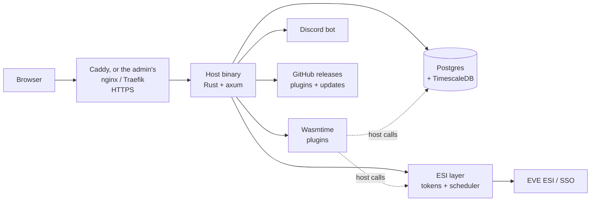
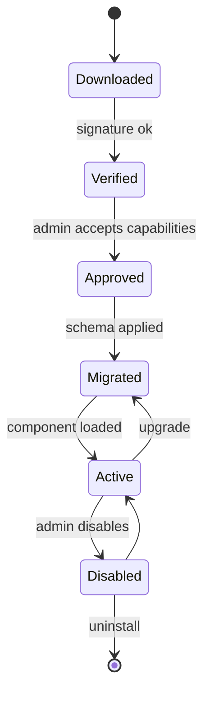

# Architecture

A single Rust binary renders the web UI on the server, runs the ESI scheduler and job workers, and hosts plugins in a Wasmtime sandbox. Postgres is the only required dependency. If this file conflicts with `docs/PRD.md`, the PRD wins.

## Overview


```mermaid
flowchart LR
    U[Browser] --> C[Caddy, or the admin's<br/>nginx / Traefik<br/>HTTPS]
    C --> H[Host binary<br/>Rust + axum]
    H --> P[(Postgres<br/>+ TimescaleDB)]
    H --> W[Wasmtime<br/>plugins]
    H --> E[ESI layer<br/>tokens + scheduler]
    E --> ESI[EVE ESI / SSO]
    H --> D[Discord bot]
    H --> G[GitHub releases<br/>plugins + updates]
    W -. host calls .-> E
    W -. host calls .-> P
```

Plugins reach ESI, storage and Discord only through host functions, never directly.

| Component | Role | Tech |
| --- | --- | --- |
| Host binary | HTTP API, auth, admin, plugin lifecycle | Rust, axum, tokio, sqlx |
| Plugin runtime | Runs plugin code in a sandbox | Wasmtime, component model (WIT) |
| ESI layer | Token vault, scheduling, shared cache, budgets | `eve-esi-client` crate |
| Job workers | ESI syncs and plugin background tasks | tokio tasks on a Postgres queue |
| UI | Server-rendered pages, navigation, plugin pages | askama templates, Basecoat, htmx |
| Database | Core data, per-plugin schemas, time series | Postgres 16+, TimescaleDB |
| Reverse proxy | TLS, HTTP/2; Caddy's certificates from Let's Encrypt only | Caddy by default; or the admin's nginx, Traefik or other proxy |

## Plugin model

Plugins are WebAssembly components installed at runtime from a GitHub repo URL, or from the apps bundled into the image, with no restart and no image rebuild. Installing from an uploaded .zip is for app developers testing a build: its route (`POST /admin/plugins`, multipart) and form exist only in a development build with the `dev-upload` feature (part of `dev`; refuses to compile in release builds, and the Hurl tests check the release image answers 405). Each runs in its own Wasmtime instance and can only call host functions its manifest declares.

First-party plugins (Alliance Auth's apps: Moon Mining, Member Audit, Fleet Activity Tracking, Structure Timers, HR Applications, Structures, Ship Replacement, Fleet Operations) live in `plugins/`, built and tested with the workspace. They come with every deployment (bundled apps, below), and can also be packaged and signed like any other by `scripts/package-plugin.sh` (built, zipped, minisign-signed with the publisher's key). They get no powers a third-party plugin couldn't, with one exception: the bundled Member Audit learns who owns each character (below).

**Bundled apps** (`crates/web-core/src/bundled.rs`): the image build (`deploy/Dockerfile`) builds every crate in `plugins/` for wasm32-wasip2 and packages each with `scripts/bundle-apps.sh` into `/usr/share/tether/apps/` (`BUNDLED_APPS_DIR`; a development build can point it at the script's output). The package layout is the usual one, but without `[publisher]` and without a signature: a bundled package ships in the same image as the binary and is exactly as trusted, so it pins no key. The server reads the directory once at startup. The Apps page lists them under "Included with Tether"; each goes through the normal review (capabilities, permissions, HTTP hosts, secrets, scopes) and the admin approves it in one click, with the review's package hash sent back so a newer image in between can't swap what was approved. `core.plugins.origin` (and `previous_origin`, migration 0039) records `bundled` or `signed`; a CHECK allows a missing signature only for `bundled`. Loading a bundled row checks the stored package's SHA-256 against the approved one (as for any app) and skips the signature and pin. A bundled app's id is reserved, and so is any installed with bundled origin (even once an image stops bundling it: it pins no key): packages from a file or GitHub under it are refused at upload and again at approval, and its updates can't be pointed at a repository. Release builds refuse a `BUNDLED_APPS_DIR` other than the image's. A newer image carrying a newer version, or the same version rebuilt (another SHA-256, for an app installed with `bundled` origin only: "Rebuilt with this Tether"), shows it as an update on the Apps page and the app's page; it goes through the same upgrade review and one-step rollback as any other upgrade (`check_upgrade` accepts the same version only for a bundled package over a bundled install). At startup, holding the lifecycle lock before any app loads, `Plugins::start` applies one itself, as the system (`plugin.upgraded` with `reason` `bundled_rebuild` or `bundled_update`), through the same upgrade path as an approval (snapshot, migrations), when the review would list nothing: `Changes` from the installed manifest to the bundled one is empty (capabilities, including scopes, HTTP hosts, secrets with their header and prefix, schedules, Discord, timers and filters; permissions added, removed, reworded or renamed; and the `[[pages]]` rules deciding who opens which page), the approved HTTP hosts and secrets are exactly what it asks for, its component loads, the last change to its package wasn't an admin's rollback (a restart never undoes one), and no new migration would run without a snapshot. The admin already approved exactly what it asks for, and it's as trusted as the binary, so no approval is lost. Anything else, and any failure, is logged and left for review; startup goes on. When two or more updates of included apps wait, "Approve all included updates" shows every app's changes on one page and approves each in turn exactly as its own review would (sudo, the lifecycle lock, its own audit entry), stopping at the first that fails. An app that fails to load with a component type-check or link error (`RuntimeError::Interface`) is shown as built for a different version of Tether's app interface, with the review of an available update right there, the raw error folded away for admins, and never uninstalling as the fix. A first-party app whose code changes should still bump its version at release.

**Package contents** (a .zip, published as a release asset on the plugin's GitHub repo, or uploaded in a development build):

- `plugin.toml`: identity, version, host API version, declared capabilities and permissions
- `plugin.wasm`: the component, built against the host's WIT interfaces
- `migrations/`: SQL files for the plugin's own schema, `0001_<name>.sql` onward with no gaps
- `ui/`: optional images (PNG, JPEG, WebP, GIF) referenced by the plugin's page descriptions
- `rotation.txt` and `rotation.txt.minisig`: only when the publisher changed keys (below)
- a detached minisign signature over the whole .zip, next to it (`<package>.zip.minisig`); only bundled apps go without

Everything else in a package is refused, as are symlinks, encrypted entries, repeated names and archive comments.

```toml
[plugin]
id = "acme.mining-ledger"          # up to 50 lowercase letters, digits, single . - _
name = "Mining ledger"
icon = "moon"                     # optional: one of Tether's icons (tether_plugins::manifest::ICONS)
version = "0.3.1"
host_api = "1"
repository = "https://github.com/example/mining-ledger"

[publisher]
key = "RWQ..."                    # minisign public key, pinned on first install

[capabilities]
storage = true
discord = ["send_message"]
http = ["janice.e-351.com"]

[capabilities.secrets.janice_api_key]   # entered by the admin; the host sends it
host = "janice.e-351.com"                # to this declared host only,
header = "X-ApiKey"                      # in this header

[capabilities.esi]
user = []                          # scopes each user consents to
data_source = ["esi-industry.read_corporation_mining.v1"]  # characters an admin designates

[[capabilities.schedules]]
name = "sync_mining"
every = "30m"                      # fixed intervals, 5m to 7d

[permissions]
view = "View mining ledger"
manage = "Manage mining ledger"

[[views]]                          # required with pages: the views bar; the first is the main page
label = "Overview"
path = ""

[[views]]
label = "Ledger"
path = "ledger"

[action]                           # optional: the one primary action
label = "Upload surveys"
path = "upload"

[[manage]]                         # the Manage pages, after Tether's Settings
label = "Ore prices"
path = "prices"
```

Unknown fields are refused, so a typo can't hide a capability. Each view, the action and each Manage page show only to whoever may open its page (`[[pages]]`). Tether adds two Manage pages of its own to every app, drawn by its templates and never by the app (`crates/web-core/src/pages/plugin_access.rs`, `plugin_activity.rs`): Data sources (`data-sources`, for an app with data-source scopes: app admins and those who may add one) and Activity (`activity`, app admins: the access log, HTTPS requests, schedules, jobs and log). Those paths and everything under them, in any case, are Tether's: a package with a page, sidebar entry, view, Manage page or action there (or a link wearing their labels) is refused at install, upgrade and bundled update (`Manifest::claims_host_page`), and requests under them never reach the app, whatever it declared before (`manifest::under_host_page`). Their data is read only after the app's page rate limit (`plugin_access::load`, `with_host`). While an app doesn't run, both are on its admin page instead.

**Publisher keys:** the key in the first installed package is pinned for that plugin id and kept even after uninstall. A package signed by another key is refused unless it carries `rotation.txt`, the exact statement `tether-key-rotation v1`, `plugin: <id>`, `old: <pinned key>`, `new: <new key>` (one per line), signed by the pinned key. A publisher who lost their key can't rotate; an admin can re-pin the plugin's key after typing its id to confirm. Pinning, rotating and re-pinning are audited.

**Install flow:** admin pastes a repo URL (host fetches the latest release), or uploads a .zip in a development build → verifies the signature and pins the publisher key on first install → shows declared capabilities → admin approves → host applies migrations → component loads. Later updates must be signed by the pinned key or they are rejected.


```mermaid
stateDiagram-v2
    [*] --> Downloaded
    Downloaded --> Verified: signature ok
    Verified --> Approved: admin accepts capabilities
    Approved --> Migrated: schema applied
    Migrated --> Active: component loaded
    Active --> Disabled: admin disables
    Disabled --> Active
    Active --> Migrated: upgrade
    Disabled --> [*]: uninstall
```

Upgrades snapshot the plugin's schema first, so a failed upgrade rolls back to the previous version and data. A newer version signed by the pinned key (or a rotation it signed) is uploaded like a new app; it must carry every applied migration unchanged and keep storage if the installed one has it. The review shows what it asks for beyond the installed version and what it no longer asks for (capabilities, HTTP hosts, secrets, shared timers, Secure Groups filters, permissions). Approving replaces the package, keeping the one it replaced in `core.plugins.previous_*`, and makes permissions (grants of dropped ones go), HTTP hosts and secrets, and the user scopes registering for it grants exactly the new version's; the plugin restarts and its new migrations run after a snapshot. Rolling back (the app's page, typing its id) is one step: the earlier package goes back, if it still checks out against the key pinned now, with what it asked for; if the upgrade ran migrations the earlier version doesn't have, the plugin's data first goes back to the newest snapshot whose migrations are all the earlier version's, restored with the plugin stopped and Tether running (TimescaleDB's database-wide restore mode is for core restores only: a plugin schema holds none of its catalog). Without snapshots, or with no such snapshot, only an upgrade that didn't change its data rolls back.

Apps from GitHub (`crates/web-core/src/plugin_github.rs`): an admin names a repository (and the app id, if it publishes several). Tether reads its 30 newest releases through the allow list (`api.github.com`), skipping drafts and pre-releases. It takes the highest `<app id>-<version>.zip` that has a `.zip.minisig` beside it and downloads only from that repository's `releases/download/` URLs (checked once parsed). Downloads may be redirected only between GitHub's own hosts (`github.com` to `release-assets.githubusercontent.com`); the API call follows no redirects and times out after 15 seconds. Both files go through the same checks as an upload (the package must be the app and version it's named for), so nothing installs without review, and the review says which repository it came from. The repository is recorded on the upload and then on the app (`core.plugins.source`, migration 0038); an admin can set or clear it on the app's page. A daily job (`plugins.update_check`), following the same switch as the platform's update check and never before an owner exists, records the newest version each repository publishes. The Apps page and the app's page show it, and "Review version" fetches it into the upgrade review above. Updates must be signed by the pinned key, as every upload must.

**Host API** (versioned WIT interfaces, unstable until the end of milestone 3):

| Interface | What a plugin can do |
| --- | --- |
| `esi` | Request ESI data for a character or corp, within approved and consented scopes |
| `storage` | Query and write its own Postgres schema only |
| `identity` | Read the current user, characters, corp, alliance, roles; the viewer's own groups (`groups`) and the groups they may be offered to pick from (`all-groups`: neither Hidden nor Internal, plus their own; every group but Internal ones for `group_management`, every group for `admin.groups`), both none in jobs and for apps not approved for the `groups` capability, which the install review names, so apps can limit things to groups as allianceauth-fittings' categories do; for the bundled Member Audit only, who owns each member character |
| `jobs` | Enqueue background work and run declared schedules |
| `discord` | Send messages and read role mappings, if declared |
| `http` | HTTPS to hosts declared in the manifest and approved by the admin only; the host adds admin-entered secrets, caps and logs every request |
| `log` | Structured logs shown in the admin panel |

**Consent, three layers:**

1. Admin approves the plugin's declared capabilities at install.
2. Pilots consent per app, as in Alliance Auth's Member Audit: whoever holds one of an app's permissions, in any state, registers characters for it from the app (the host's Register Character, `/register?app=<id>`: one EVE login granting the app's user scopes, and the state's requirements with them). An app reads only its characters: those registered for it (`core.app_characters`, written by that login, by the state's checklist for the apps the state requires (below), and by upgrades keeping what apps read before; pilots unregister them on the same page, and a character that leaves its account, is removed or sold leaves every app), on accounts holding one of its permissions (`core.holds_app_permission`, the same rules as effective permissions), whose valid token carries every one of its user scopes. Scopes granted for the state or another app don't by themselves register a character for anything. A registration outlives a revoked or deleted token (as aa-memberaudit keeps the character): the app reads the character again once a token carries its scopes, so Unregister (possible without the app's permission) is how a pilot withdraws. Meanwhile the bundled Member Audit alone still finds the character in `esi.characters` (not one sold: its owner hash changed), keeps what it read and shows its updates paused, as aa-memberaudit does; a read of it answers `token` (Jay, 2026-10-06). No state requires an app unless an admin says so (one click on the States page, `core.state_apps`, AA's Member Audit compliance groups): then every character of its accounts must be registered for the app, its token carrying the app's scopes, and registering from the state's checklist (which says so) registers for it too, while the pilot holds one of the app's permissions; a plain Add Character doesn't. Corporation data comes only from owner characters (data sources) added, as Alliance Auth adds them, by holders of the app's add permission with their own characters: one EVE login, in use at once, no admin approval (Jay, 2026-09-26). A source is used only while its character stays on the account that added it, in the corporation it was added for, and that account is active and not blacklisted; app admins see and remove any, owners withdraw their own, and every change is audited. The app's Data sources page says how each is doing from the access log since it was last added (`plugin_esi::source_reads`, by endpoint): a login that failed after its last good call, a corporation endpoint ESI refuses (403: an in-game role), or working; for app admins also which Member corporations it reads. While one isn't working (judged on the last day), the app's other pages carry a notice for whoever looks after it.
3. The host checks both on every call. Plugins never see a token.

**Shared doctrines** (the `doctrines` interface, migration 0053; approved by Jay on 2026-09-27 for aa-fleetpings' and aa-fat's `use_doctrines_from_fittings_module`): an app with `doctrines = "publish"` replaces its list in `core.shared_doctrines` (name, a link inside the app, and who sees each: everyone, or members of any of its groups; holders of the app's named see-all permission see every one, as `fittings.manage`). Fittings publishes after every change and daily, seen exactly as on its own pages. Fleet Pings (when "Use doctrines from Fittings" is on) and apps with `doctrines = "read"` get only the doctrines the pilot may see, from running publishers; Fleet Pings then sets its own doctrines aside, as aa-fleetpings does, and refuses a shared doctrine's name the pilot can't see. Rows go with their app.

**Downloads** (the `downloads` interface, migration 0055; approved by Jay on 2026-09-27 for aa-memberaudit's data exports): an app with `downloads = true` hands over rows in a job or submit (`begin` returns a build, which `append` and `finish` name), and the host writes the CSV (quoting, CRLF lines, spreadsheet formulas defused, full-width forms too) into `core.plugin_download_parts`, a new version built beside the finished one and swapped in at `finish`; a newer `begin` supersedes an older build, whose chain is told to stop. Limits, checked under the row's lock: 20 downloads an app, 50 MB and 10,000 parts each. `/plugins/<id>/downloads/<name>` streams the finished file from Postgres as an attachment, `no-store`, to holders of the app permission named at `begin` with a main (404 to others, as pages; the pages' rate limit), and audits each download (`plugin.download`). The two tables' data is left out of core snapshots and backups. Rows go with their app.

**Static data** (`crates/sde`; Jay, 2026-10-07): the parts of CCP's static data export apps need (types with their names, groups, market groups, volumes, portion sizes, meta level and compressed form; groups; categories; the market group tree; reprocessing materials; solar systems) are committed as tab-separated tables under `crates/sde/data` and built in, read once. `scripts/update-sde.sh` refreshes them from developers.eveonline.com from a developer's shell; neither the image build nor the running app fetches them. Apps read them through the catalogue's `sde-*` endpoints (`crates/web-core/src/static_data.rs`): no token, no ESI call.

**Structure names** (`crates/web-core/src/structure_names.rs`, migration 0057; Jay, 2026-10-05): ESI names an Upwell structure only to a character that may dock there, so an app's `source-structure` or `universe-structure` read may be refused (a Director alt off the access list). Then Tether asks through other members' characters (active accounts in Member or a state an admin put above it, never Blue, Guest or blacklisted ones, with a valid token carrying `esi-universe.read_structures.v1`), one lookup of a structure at a time (an advisory lock), at most three refusals a structure an hour, only while ESI's budget has room, and answers with the name, system and type only; a character refused a structure isn't asked again for a week (`core.structure_name_misses`). Names any app read are kept for every app a week (`core.structure_names`) and answer later reads before ESI is asked; the hourly prune forgets both after a week. Nothing else is read with those tokens, and apps never see one; the extra calls count against the app's run and every refusal against its ESI error throttle. The install review says an app with the structure scope can name any structure a member may dock at.

**Notices** (the `notify` interface, `crates/web-core/src/plugin_notify.rs`; approved by Jay on 2026-10-04 for aa-blueprints' notifications; Blueprints, Structures and Moon Mining also send their AA app's admin notices, to holders of their `manage` permission, superusers included, through `holders`; Structures tells whoever asked for a channel's test notification how it went, through `account`): an app with `notify = true` sends plain-text notices into `core.notifications` (the bell) from a submit or a job, never from a page render. `account` reaches one account only if it holds one of the app's own permissions (its audience; an account id outside it gets `false`, nothing sent); `holders` reaches every holder of one of the app's own permissions (as the Permissions Audit computes them) but one it names, refusing a permission held by more than 200. `submitter` reaches an account that submitted one of the app's forms (an applicant, a requester; approved by Jay on 2026-10-07 for AA's applicant and requester notices), whatever it holds, and nobody else: only while handling a form the viewer posted (`submit` with the host's viewer, never a page or a job, never for an account the app names) does `submitter-reference` hand the app a reference to that viewer's account (`core.plugin_submitters`: one random 32-hex reference per account and app, always the same, telling nothing about the account, gone with the app or the account), which the app keeps with what was submitted and notifies by later from any submit or job, for a year after the last form post it was asked for in (so a button clicked once doesn't let an app reach someone forever); a reference of another app, one never made or one past its year reaches nobody. The host puts the app's name before the title so no app passes for Tether, strips control and formatting characters, refuses titles over 100 characters and messages over 1,000, and skips a notice already waiting unread. Limits: 10 notify calls a call, 20 notices an hour from one app to one account (past it, skipped), 500 an hour from one app in all (in memory, per process). The install review lists the capability.

**Writes to EVE** (`esi.post`; approved by Jay on 2026-09-27 for allianceauth-fittings' Save to EVE): the catalogue's writes are a separate list (`tether_esi::plugin::WRITE_ENDPOINTS`, today only `character-fitting-save`, `POST /characters/{id}/fittings/`), so no read reaches one. The host allows a write only in `submit` (`submit_as` alone sets the call's `writes_allowed`; renders and jobs never do), one per form post, only for one of that viewer's own characters (checked against the viewer and again against the database), and only one registered for the app with the endpoint's scope. It checks the body against ESI's type (so only what that type holds is sent, without control characters), records it on the audit log as the pilot (`plugin.esi_write`) before sending, and doesn't send if that fails. It sends once, at interactive priority, without retrying, in its own task so the app's deadline can't cut it off unlogged, and records the outcome in the app's access log. A write scope is never required of anyone: an app asking for one can't be required of a state, requirements ignore one should it be, and an upgrade that adds one is refused while a state requires the app. Such an upgrade also clears the app's registrations (`plugin.registrations_cleared`), since pilots consented to it reading, not writing; they register again.

**Who owns a character.** Apps see an account only while its owner is looking: `identity.current` gives the viewer's own characters, while `esi.characters` lists the app's characters (of any account holding one of its permissions) with no owner, and Secure Groups filters are reported per character and combined into accounts by the host. So no app can work out which characters share an account, or whose alts they are. The one exception, decided by Jay on 2026-09-26, is `identity.owners`: for each of `esi.characters` (the same characters: since 2026-09-27, of accounts in any state holding one of Member Audit's permissions, as AA gates it), the account's main (id, name, corporation, alliance) and state. aa-memberaudit's Character Finder shows each character's main, main organisation and state, and its `view_same_corporation` and `view_same_alliance` scopes go by the owner's main, so officers see every alt of the pilots whose main is in their corporation; without the linkage Member Audit could only scope by each character's own corporation, which misses alts elsewhere and shows alts of other corporations' pilots. Only first-party Member Audit gets it, as bundled with Tether: the host answers only a running plugin whose id is `tether.member-audit` and whose package's recorded origin is `bundled` (`plugin_services::may_see_owners`), decided when the component is loaded and checked again on each call, so a call still running from a replaced package keeps its own answer; every other plugin gets none. Under the same gate, `identity.members` (Jay, 2026-10-07: aa-memberaudit's Finder lists members' unregistered characters) gives every account holding one of Member Audit's permissions, its main and state, and all its characters, each marked registered for the app or not (none sold on: `compliance::serving_members`), for the Finder's unregistered characters, the User and Corporation Compliance reports and the sheet's owner and other characters. The bundled review says so, and each read is logged. Bundled ids are reserved, so no package from a file or GitHub can take that id while Tether bundles it or once it was installed bundled; a signed package that took it anyway (a Tether without bundled apps) is `signed`, so it learns nothing. No manifest capability offers it: third-party apps can never ask for it.

In the UI plugins are called apps, as in AA; the SDK and code keep "plugin".

**AI-friendly SDK:** WIT files are the machine-readable contract. The plugin template ships an `AGENTS.md` describing the SDK, capabilities and patterns, plus complete example plugins. `platform plugin dev` runs against mock ESI with hot reload. Errors are actionable: a call outside declared scopes names the exact manifest entry to add.

**Resource limits:** Wasmtime fuel or epoch interruption plus a memory cap per plugin. Each plugin's database role has a `statement_timeout`.

## ESI layer

The host is the only thing that talks to ESI. It owns every token, schedules every sync, and fetches each piece of data once however many plugins want it.

- **Token vault:** refresh tokens encrypted at rest with a key from the environment; access tokens cached in memory and refreshed before expiry; each token records its granted scopes; `invalid_grant` marks the token revoked and prompts the user to re-link.
- **Scheduler:** next fetch comes from the `Expires` header; conditional requests with `ETag` / `If-None-Match`; interactive requests jump ahead of bulk syncs.
- **Cache:** eve-esi-client's response cache is `core.esi_cache` in Postgres (`tether_esi::cache::PgCache`): shared by every worker, kept across restarts, keyed by URL and the token's `sub` (empty for public requests), pruned hourly by expiry and a row cap. Only the host's own unauthenticated requests use it. Calls carrying a character's token (plugin calls, Corp Stats) never do: the library keys its cache by the token it sees on the request, and these carry theirs as a client default header, so they go through `EsiInner::without_cache()` and ESI checks the character's scopes and roles every time. The one exception, approved by Jay on 2026-10-06 for Blueprints' corporate locations and on 2026-10-07 for Structures' assets and Buyback's hangar stock, is the catalogue's `corporation-asset-places`, `corporation-structure-assets` and `corporation-hangar-assets` (`tether_esi::asset_places`), answered from one read: it reads every page of a corporation's assets in the background, each page with a token the vault hands out then and only while the character is still the app's approved data source in that corporation (the app running, the account active and not blacklisted), and keeps that one read in memory for an hour after it finished, for that corporation and data-source character only. ESI still checks the character's scopes and roles on every call: before answering from the read, the call asks ESI for the first page again with a fresh token, and a refusal (the Director role gone) ends the read for that character. So the places an answer gives may be up to an hour old, plus the read's own length for its first pages, as ESI's own hour-long cache of corporation assets would be. A failed read answers with its error for five minutes, again only for that character. At most two reads run at once, and past about four million items kept across every corporation the oldest reads go first. Nothing of it is written to Postgres, and a restart forgets it. A response ESI marks `private` or `no-store` is never stored without a principal.
- **Budgets:** eve-esi-client tracks ESI's error-limit and rate-limit budgets and slows down before hitting them; the host reads them from its accessors (`error_budget()`, `rate_budgets()`), never from response headers, which cached responses don't carry, and counts what came back (fresh, cached, revalidated, errors) for the dashboard; bulk work backs off earlier than interactive requests; plugin calls share the same limiters; per-plugin shares, so one misbehaving plugin is throttled and flagged instead of getting the whole instance blocked.
- **User-Agent:** includes the admin contact, set once at the host level.
- **Outbound (N5):** eve-esi-client makes no connections of its own. Its ESI client and its EVE SSO token exchange both get their `reqwest::Client` from `tether_net::Outbound::library_client` (allow-listed DNS, no redirects, no proxies), and the ESI base URL and SSO token URL are checked against the allow-list, scheme and port included, before use. A redirecting token endpoint therefore can't forward a code or refresh token anywhere.

## Storage and jobs

Postgres holds everything, including the job queue.

- `core` schema: users, characters, tokens, corps, alliances, states, groups, permissions, audit log. The audit log is append-only and read newest first by `(at, id)`; Administration filters it by who, action, app and date, each from an index of its own (migration 0065; the app an entry is about is `core.audit_log_app(target, details)`), and exports the filtered rows as CSV (`/admin/audit.csv`, `admin.audit`, read a thousand at a time as they're sent, the export itself audited as `audit.export`; ten a minute per account, and a link from another site opens the log with its filters instead of exporting).
- `plugin_<id>` schemas: one per plugin with `storage = true`, owned by Tether's role. The plugin's own login role (random password, sealed in `core.secrets`) can use and create objects only there: no rights on `core`, `public` or other plugins' schemas, no temporary tables, no advisory locks. The host reaches it through a small pool per plugin, and sets timeouts, memory and `search_path` before every statement, since a role can change its own defaults. Uninstalling drops the schema and role.
- TimescaleDB hypertables are for Tether's own time series for now: plugin roles have no access to `public`, where TimescaleDB's functions live. If a plugin needs one, the host can offer it through a host call.
- `esi_cache`: cached ESI responses (status, headers, body out of line, ETag, expiry), host-only; see the ESI layer.
- Job queue: a `jobs` table polled with `SELECT … FOR UPDATE SKIP LOCKED`; exponential backoff; dead-letter state; visible in the admin panel. Workers are tokio tasks inside the host; the count is a config value.
- Schedules (`core.schedules`, Tether's and apps' alike, apps' named `plugin:<app id>:<name>`) queue their job every interval, checked every 15 seconds. Admins can run one now: Run now on Health (Tether's) or the app's Apps page (its own), or `tether jobs run <schedule>` (a trailing `*` runs every schedule it starts). A run queues that schedule's job at once and restarts its interval; a run still queued or running isn't doubled, and each schedule runs by hand at most once a minute (apps' jobs spend ESI budget). Audited as `schedule.run_now`.
- Core migrations are embedded in the binary and run on startup. Plugin migrations run on install and upgrade, each in its own transaction as the plugin's role, recorded with a checksum so an applied one can't change; upgrades take a snapshot first.
- Snapshots (`tether-snapshots`, N14): `pg_dump --format=custom` of one kind, streamed through encryption to the snapshots volume (`SNAPSHOT_DIR`, `/var/lib/tether/snapshots`). Core is the `core` schema plus the migration history (`public._sqlx_migrations`); a plugin is its `plugin_<id>` schema plus its rows in `core.plugin_migrations`. The migration records ride in the file's header, read in the same exported database snapshot as the dump. Taken at startup before pending core migrations (only when the database already has some; no snapshot, no migration: `SKIP_MIGRATION_SNAPSHOT=true` is for local development only) and before a plugin's migrations on an upgrade, into `snapshots/`, the last 5 per kind; free disk (`df`) is checked against the schema's table size plus 64 MiB first. The client tools must be Postgres 16's, like the server: the app image installs `postgresql-client-16`.
- Nightly encrypted backups reuse it: the `backups.nightly` job snapshots core and every plugin with storage into `backups/`, a week kept per kind. Copying them off the box, optionally to S3-compatible storage, is deferred to the pre-launch checklist.
- Snapshot files: magic, format, a plaintext JSON header (kind, reason, time, Tether, Postgres and TimescaleDB versions, migration records), then the dump as STREAM chunks (64 KiB; RustCrypto's `aead-stream`, BE32: a random 19-byte prefix, a 32-bit counter and a last-chunk flag per nonce) of XChaCha20-Poly1305 under a key derived from `ENCRYPTION_KEY` (HKDF-SHA-256 expand, label `tether snapshots v1`), each chunk's associated data the hash of the header, so the header can be read without the key but not changed. Chunks can't be reordered, dropped or truncated unnoticed; nothing is held whole in memory.
- `tether rollback` (with the server stopped; it refuses while the server's connections are open): by default the newest core snapshot taken before migrations, or `--plugin <id>`, or any snapshot or backup by `--snapshot <name>` (`--list` shows them). It shows the snapshot's time, warns that newer data of that kind is lost, and asks to confirm (`--yes` for scripts). It refuses a TimescaleDB version other than the snapshot's, and a plugin reinstalled since (another role). The restore reads the whole file once to check it, calls `timescaledb_pre_restore()` (core only), runs `pg_restore`'s SQL through `psql` in a transaction committed only if the whole file opened and both tools succeeded, then `timescaledb_post_restore()` (startup also switches off a restore mode an interrupted rollback left on). Core's runs as Tether's role between `DROP SCHEMA core CASCADE` and, in the same transaction, the migration records, the end of every session (a rollback mustn't revive ones ended since), and the `snapshot.restored` audit entry with how many audit entries it discarded. A plugin's never runs as Tether's role, because its CHECK constraints, domains and generated columns call its own functions as whoever loads the data: Tether sets the schema aside and makes an empty one as `plugin_storage` does, `psql` logs in as the plugin's role (its password from the vault) to load the dump's objects without owners or grants, then Tether drops the old schema and puts the migration records back, audited in that transaction. A failure puts the old schema back, and a restore cut short is undone by the next attempt. Other kinds are never touched. Revoked permissions, tokens and blacklist entries come back with a core rollback; the prompt says so.
- A startup that fails its migrations doesn't take a new snapshot on every restart (which would push the one from before the upgrade out of the last five): the newest one is reused while the same migrations are applied and that kind hasn't run since it was taken. The server records a run in `SNAPSHOT_DIR` after migrating, and a plugin each time it loads. (Admin CLI commands run meanwhile don't count as a run: what they change after the reused snapshot is lost on rollback like anything else newer.)
- A restore holds an advisory lock: a second rollback refuses, and the server won't start until it's done. A plugin restore cut short leaves its old data in a `rollback_<hash>` schema; the plugin won't load and `doctor` warns until a rollback of it runs again, which puts that data back first. For the load, the plugin role's `temp_file_limit` is raised (to eight times the snapshot, 1 to 64 GiB) with a per-database role setting, removed afterwards, and removed when the plugin loads if a crash left it.
- Child processes (`pg_dump`, `pg_restore`, `psql`, `df`) start with an empty environment plus PATH, HOME and locale, and the `PG*` connection variables (password in `PGPASSWORD`, TLS mode from `DATABASE_URL`); they never see `ENCRYPTION_KEY` or the other secrets.

## Identity and permissions

EVE SSO is the only login. No email.

- One account holds many characters; the first linked is the main and can be changed. Alts are added by logging in with them while signed in. Only the main signs in, as AA: an account without a main (it was sold, moved or lost its token) can't be signed in to until a browser still signed in picks a new one with Change Main, or an admin sets one from the shell (`tether users main`).
- Superusers (AA's `is_superuser`, `core.accounts.is_owner`) hold every permission; there can be any number. The first is the first account to log in from a browser that entered the setup token (the first-run wizard); superusers make and unmake others from a user's page (sudo mode, audited), and the last one can't be unmade. The token is refused while a superuser exists; if the last superuser account loses its last character (it stops being a superuser then), setup reopens and the token works again, so it stays secret for the life of the instance. Admins, superusers included, sign in with EVE SSO like everyone else, and what they may do comes from permissions.
- Every route needs a login (Jay, 2026-10-04) but the way in: `/login`, `/auth/login` and EVE's and Discord's callbacks (which check their own state), logging out, `/health` and `/ready`, `/metrics` (off by default; its own bearer token, below), `/theme.css` and `/static/`, and `/api/setup/probe` (it echoes a nonce, so `tether doctor` can check the public URL). Signed out, pages send to `/login` and the API answers 401. The setup wizard (`/setup`, `/api/setup`) is open only until there's an owner; after that it's closed to the signed out like the rest (`auth::sign_in_first`). `crates/web/tests/it/signed_out.rs` reads every route from the router and checks each method signed out, so a new route can't be left open by accident.
- Signed out, a page that sends the browser to `/login` remembers where it was headed, so logging in lands there instead of on the Dashboard. The redirect stays plain `/login`; the path (with its query) is kept server-side in `core.login_destinations` under the hash of a random handle in the `__Host-tether_next` cookie (15 minutes), and `/auth/login` moves it onto the login attempt, so nothing about it reaches EVE. Only a browser's page visits count (GET, not htmx, an event stream or a script's fetch); form posts never do, as nothing is replayed. Every destination, remembered or named by a link (`/auth/login?return_to=`), must be a same-site path: one leading `/`, no `//` anywhere, no backslashes, printable ASCII only, at most 512 bytes, and not back into logging in; anything else lands on `/` (`auth::safe_path`).
- Sessions (`core.sessions`): a random token in the `__Host-tether_session` cookie, stored only as its SHA-256, lasting 14 days from logging in (never extended); its last use is noted at most every 5 minutes. The account menu's Sessions page (`crates/web-core/src/sessions.rs`) lists the account's live sessions by a plain id (`core.sessions.id`; never the cookie or its hash): when each logged in, was last used and ends, and a coarse browser label read once from the User-Agent at sign-in (one of five browsers on one of six systems, "Firefox on Windows"; the header itself isn't kept, and no IP address is, migration 0075). Sign out ends one of the account's other sessions (this browser's own is Log out) and Sign out everywhere else every one but this, audited as `session.sign_out` and `session.sign_out_others`. An admin with `admin.users` signs a user out everywhere from their page (sudo mode; only an account whose permissions are all the admin's, as deactivating, and never their own), audited as `session.sign_out_all`. Access tokens reach none of it.
- States, Alliance Auth style: **Member**, **Blue** and **Guest** built in, plus any admins create, each with a priority and a list of alliances, corporations and characters. An account's state is the highest-priority state whose list matches its main, or that is public (AA's: any main); no match is Guest. Re-evaluated on every affiliation sync via ESI's bulk affiliation endpoint, and whenever the states change.
- Scope compliance: each state other than Guest requires scopes (Member: the corporation member list scope, plus admin additions; an admin can require an app, which counts a character only once it is registered for the app with the app's scopes; plain scope requirements check scopes alone) on every character of the account. As in Alliance Auth, an account that falls short keeps its state but is flagged for officers and left out of compliance groups until every character is registered. As Member Audit's registration, a revoked token still counts with the scopes it carried (its owner is asked to log in again); the ownership check takes the character off the account a day later unless they do. The host's 5-minute `compliance.token_errors` job sends aa-memberaudit's token-error notice for Member Audit as bundled: once per character registered with it whose token is revoked or deleted (not sold) or short of one of its scopes, until it works again (`core.app_characters.token_error_notified_at`). Plugins' user-scope calls need one of the app's characters (above). When a login makes a character one of an app's characters, that app runs its schedules at once (queued before the login answers), and adding a data source runs that app's: at most every minute while there's plenty of ESI budget left (`Esi::has_room`: the error budget above the bulk reserve, every rate-limit group with a quarter of its tokens; Jay, 2026-10-05), else every ten minutes (every minute for app admins, as their Run now); a run already queued isn't doubled, and one running gets one more queued behind it, since it may have read before the change: best effort, never failing the login or the add, audited as `schedule.run_now` (by the system, or the pilot who added it) in the transaction that queues the run. Corp Stats reads every covered corporation's member list daily, and at once when a character registers in a corporation with none yet, to show members who never registered: with any registered Member character in that corporation (`GET /corporations/{id}/members` needs the scope, no in-game role), the one whose token read it last first (`core.corp_member_lists.source_character_id`); one that fails is skipped for the next, and nobody is notified, since nobody volunteered it. Update Now is for officers and the owner of that last token, as AA's, at most every minute while ESI's budget has room (every 15 while it's low; ESI caches the list for an hour). Change Main reads the account's affiliations at once while there's room, and so does an admin's change that re-evaluates every state (all characters' affiliations, then every account); a saved app setting runs the app's schedules, queued before the save answers (Jay, 2026-10-05).
- Groups add access on top of states, with Alliance Auth's flags (Internal, Hidden, Open, Public, Restricted) and allowed states. Pilots join and leave on the Groups page; Group Leaders (and holders of `group_management`) decide requests in Group Management, and each group keeps an Audit Log. Compliance groups are Internal groups Tether fills with the compliant accounts of their allowed states. The rules live in `tether_core::groups` and `tether_web::groups`.
- Permissions come from the core and from plugin manifests, and are assigned to states, groups or single users (AA's user permissions; `core.permission_grants` has exactly one of `state_id`, `group_id`, `account_id`). A user's own grants count while the account is active, main or not (blacklisted too: as AA's, the Blacklist changes only the state); only a permission the granter holds goes to or comes from a state, a group or a user, and nobody grants themselves. A public state, like Guest, holds no sensitive permission and fills no compliance, smart or Auto Groups. Every change is audit-logged.
- Personal access tokens with explicit scopes and expiry, for bots and scripts.
- Sudo mode (`crates/web-core/src/sudo.rs`), as GitHub's: superuser-only and especially sensitive actions need an EVE login with the account's main in the last 15 minutes. The session records when that last happened (`core.sessions.reauthenticated_at`): a plain login with the main sets it, and so does re-authenticating; Add Character, offers, Change Main and a returning owner re-attached as the main of a main-less account prove only some character, so their new session keeps the old one's time. (The returning-owner case is defence in depth: once that character is the main, logging in with it again confirms. What stops a stolen, stale session planting a main is that it can't link a character or delete the main's token without sudo.) Otherwise the action is refused before anything changes, and the browser goes to "Confirm it's you" (`/reauthenticate`), which names the action; its button starts an EVE login (purpose `reauth`) that must be the signed-in account's main with its recorded owner hash (nothing is linked, moved or stored), audited as `session.reauth` with the action. A refused gated action is audited too (`session.sudo_required`, with the action and path), so a stale session probing is visible in the audit log. Taking sensitive permissions away is gated like giving them: revoking a grant, removing someone from (or deleting) a group that grants one, deleting an Auto Groups config whose groups do, and blacklisting an account that holds one (as deactivating: a blacklisted account holds only what the Blacklist state is granted, its own grants, and those of groups that don't exclude the Blacklist state). Afterwards the browser is back on the page it posted from (its same-site Referer, else the Dashboard), where the admin submits again: nothing is replayed, and a POST never is. htmx requests are sent there with `HX-Redirect`; the JSON API answers 403. The gated actions, each checked where the action happens so pages and the API share it:
  - granting or revoking a sensitive permission (`tether_core::permissions::is_sensitive`), making or unmaking a superuser, and letting anyone into a group that grants one (adding members, accepting requests, appointing leaders or leader groups, opening it, making it a compliance group, changing its smart filters or Auto Groups);
  - approving an app's install or upgrade, rolling an app back, uninstalling it, re-pinning its publisher key, and setting its secrets;
  - deactivating or reactivating an account, and signing one out everywhere;
  - creating a personal access token;
  - changing setup (the EVE application) once a superuser exists;
  - the Discord settings (application, bot token and client secret);
  - upgrading or rolling Tether back from the console;
  - what only a superuser may do to a Restricted group (as AA's code: set or clear the flag, and add or remove members directly on the admin pages);
  - removing a character from someone else's account (an admin with `admin.users`, from the user's page, and only an account whose permissions are all the admin's, as deactivating);
  - for superusers and accounts holding a sensitive permission only: Change Main (picking a character or logging in with one), linking a character (Add Character, registering, offers), deleting the main's token, and removing one of their own characters. The main is what confirms it's them, so a stolen session mustn't plant a character of its own and make it the main. Everyone else does these freely.
  States aren't gated: an admin who changes who a state covers moves accounts in and out of its grants without a fresh login, so keep sensitive permissions on groups rather than states.
  Everyday admin work (states, ordinary groups, pings, the menu, enabling or disabling an app) isn't gated. Personal access tokens aren't browsers and can't log in again, so they're let through, as GitHub's are: making one is gated, each carries the permissions it uses explicitly, and a token never counts as a superuser, so superuser-only actions refuse it anyway. The CLI (run on the host) and background jobs aren't gated either. `tether rollback` is CLI-only.

## UI

Server-rendered HTML from Rust. No JS framework, no npm, no separate frontend build. The look is defined in `docs/DESIGN.md`.

- **askama** templates, compiled into the binary and type-checked at build time.
- **The web crates**, split so an edit recompiles narrowly: `tether-web-core` (`crates/web-core`) holds the state, sessions and auth, the domain modules, jobs and the page infrastructure (`PageError`, `Shell`, `render`, staying on the page, the admin guard's building blocks); `tether-web-admin`, `tether-web-member` and `tether-web-apps` hold the pages (Administration's; the pilot's; the app page renderer with its instruments), each re-exporting the core at its root; `tether-web` (`crates/web`) is the router, the JSON API and OpenAPI, and re-exports the core so the server, CLI and tests name one crate. The page crates don't depend on each other, so they build in parallel, and changing a page rebuilds only its crate and the router.
- **Basecoat** supplies the shadcn-style components as plain CSS classes (`btn`, `card`, `input`, `table`, `tabs`). Its CSS is vendored into `assets/vendor/` and themed with the tokens from `DESIGN.md`.
- **Staying on the page** (`crates/web-core/src/pages/stay.rs`, DESIGN.md's Page hygiene and state): handlers answer form posts as plain pages do (a redirect back, an error page, a page), and a middleware turns a boosted post's answer into what htmx needs to stay put: `HX-Location` back to the page it came from with that page's query (from `HX-Current-URL`, only when it's this site and a safe path with the same path as the redirect), a problem toast instead of an error page, or `HX-Reswap`/`HX-Push-Url: false` for a page. Handlers ask for toasts with a response extension, sent as an `HX-Trigger` event (ASCII JSON) that `assets/live.js` draws as text.
- **No reloads** (Jay, 2026-09-30): the body is `hx-boost`, so every link and form fetches the next page and swaps it in; the sky, toasts and confirmation stay. htmx keeps no page in the browser (`historyCacheSize` 0: Back asks the server, which checks the session). What can't be swapped navigates fully (`stay::leave`): an http(s) redirect off the site (EVE SSO, Discord) and a file download, answered with `HX-Redirect`; the login and authorization buttons opt out with `hx-boost="false"`, and app download links too.
- **App pages, laid out by the host** (`crates/web-apps/src/pages/plugin_pages.rs`): the header's links and buttons in one row under the title; titled tables with the same four or more columns drawn as one, narrow sections side by side; any table longer than 25 rows paged (`_p0`, `_p1`… in the address, stripped before the app sees the query); an app's `settings` pages (and `settings/...`) linked from its Administration page, not its own header; a settings form (`section::settings`) drawn as its groups with the save bar, posted and checked as one form (`page::settings_form`), each field left as drawn (`_drawn`: fingerprints of what the page showed) taking its value now so a save changes only what the person changed, a refused save from the page answered with a toast alone so its unsaved changes stay (`assets/live.js` marks them and guards leaving).
- **Change character**: the account menu lists the account's characters to act as, remembered per browser in `__Host-tether_acting` (a character id, honoured only while it's one of the account's own, removed on logout). Apps read it through `identity.acting()`; `viewer.main`, and every access scope an app builds on it, stays the account's real main.
- **htmx** handles interactivity without writing JavaScript: partial page swaps for tabs, filters, sorting, pagination and forms; server-sent events for live countdowns, pop alerts and job status. Server-sent events come from axum's `Sse`; the bundled script `assets/notifications.js` keeps the top bar's unread count live from `/notifications/stream`, fed by Postgres `LISTEN tether_notifications` (a trigger on `core.notifications`), so notifications from jobs and the CLI arrive too. The other, `assets/live.js`, ticks app pages' countdowns and progress bars between known instants (read from `datetime` and `data-` attributes the host writes) and makes their Copy buttons copy. Both are small, bundled and CSP-safe (no inline script).
- **Tailwind's standalone CLI** (a single binary) builds the CSS. No Node or npm anywhere.
- Fonts (Geist, Geist Mono), icons and htmx are bundled and served by the host. The browser's only external requests are to CCP's image server.
- Navigation is built from core routes plus plugin manifests, filtered by the viewer's permissions. The default sections are Account, Fleet, Industry, Corporation, Apps and Admin; an app's `[[navigation]]` entry names its section (Apps if it names none), admins rearrange everything on the Menu page, and empty sections aren't shown.
- **The command palette** (`crates/web-member/src/pages/palette.rs`, `GET /palette`): what one account may open is `pages::reach` (its permissions, the admin pages and apps' links they allow, the sidebar as the Menu arranges it), which the shell is built from too, so the palette lists exactly what the sidebar, Administration and the apps' frames would. Each search answers htmx with an HTML fragment of the matching pages, pilots (holders of `admin.users`, through Users' own search) and actions; without htmx, the same search as a page. Nothing is indexed or cached. `assets/live.js` opens it (⌘K, Ctrl K, or the command bar's field) and moves its highlight.
- A small JSON API (documented with utoipa) serves bots, scripts and personal access tokens; the UI itself uses HTML over htmx.

**Plugin pages are declarative.** A plugin returns a page description (header, stat row, tables, cards, tabs, forms, badges, charts) as structured data. The host validates it and renders it with the same templates as core pages. Every plugin looks native, and no plugin code ever runs in members' browsers. Interactive elements in a description map to host-provided htmx actions that call back into the plugin. Lists get the host's toolbar (`crates/web-apps/src/pages/plugin_lists.rs`, drawn with core pages' own, `crates/web-core/src/pages/toolbar.rs`): a search kept in the address that the host runs among the rows a page shows, unless the page's `toolbar` says it searches its own data; the page's filters as chips; its tabs as view chips. A `record-panel` is the selected row's details beside the list, selected by a query parameter that a row's link adds to the page's address.

- Entities (characters, corporations, alliances, factions, types) carry a kind, an id and a name; the host builds the CCP image server address from the kind and id, so a plugin can't point a browser anywhere else.
- Row actions post to the page's own address like its forms. Before `submit`, the host renders the page for that viewer again and accepts the post only if the page still offers that exact button (form id and every hidden value), so a viewer can post only what the plugin showed them.
- Tabs are links with the page's query and the host's `_tab`, targeting `#plugin-content`: htmx sends `HX-Target: plugin-content` and the host answers with the content alone (not for a history restore, which gets the page). A post from the page itself (its `HX-Current-URL`) is answered with the content in place (`HX-Retarget`, `HX-Reswap`, no new address) and a toast; one from another page (the Dashboard, which shows the character audit's main page) goes back there. An app's redirect to the same page keeps the `_tab`. Without htmx, the whole page or the redirect, as before. None of this changes which posts are accepted.
- A page that sets `refresh-seconds` has its content reloaded by htmx (`hx-trigger="every Ns"` on `#plugin-content`, the request naming it in `HX-Trigger`); the host answers such a reload with the content alone, 204 to keep what's shown after a failure, or `HX-Refresh` when the page is gone for the viewer. It stops once a render leaves it out, and never applies to a page with a form or an audited page; the page and its content alone vary on `HX-Request`, `HX-Target` and `HX-Trigger`, and content alone and audited pages are `no-store`.
- A `[[pages]]` rule with `audit = true` writes every render of a page under it (a view, a reload, a form post) to the core audit log as `plugin.page_view` (actor, `plugin:<id>`, path, query, how), before the plugin is called; if that write fails the page isn't shown.

## Discord

Built into the host, not a plugin. REST only (twilight-http): no gateway connection. One bot serves the core and every plugin. Members with Discord access (`discord.access_discord`, a permission granted to nobody by default, as in AA) join the server through OAuth linking, which adds them with their roles; after that, only ESI affiliation drives role changes. Losing access, or unlinking, removes them from the server; a member the sync finds no longer in the server is unlinked and notified, as AA.

- Account linking via OAuth from the Dashboard.
- Tier and group to role mappings, applied automatically as membership changes.
- Every five minutes everyone linked is synced again (`discord.sync_all`), catching what no trigger sees: a state's rules, permissions, the name format, changes made by hand in Discord. A member whose sync is still waiting gets no second one.
- Nicknames from AA's Name Formatter: a format per state, such as `[{corp_ticker}] {character_name}`, when nickname sync is on (AA's `DISCORD_SYNC_NAMES`, off by default).
- Fleet ping broadcasts with channel and role targeting; plugins can send through the same path if declared. An app's message pings only roles of Tether's own mappings, which the host finds by name, so apps never pass a role id and never reach @everyone, @here or a person: `send`'s one mention names a state (refused without a role), and `send-message` (Jay, 2026-10-07, for aa-structures' ping groups) takes up to 10 pings at once, of states and, for an app approved for `mention_groups` (`[capabilities] discord`, a line of its own in the install review), of groups. Each ping resolves to the first role mapped to that state or group (any case; `discord::ping_roles`), each role once; one with none (no such state or group, nothing mapped, a name longer than any) is left out and logged with the app's id, and the message still goes. `allowed_mentions` lists exactly those roles, and typed `@everyone`/`@here` are defused as for every app message. Discord refusing the bot (no access to the channel, a channel deleted, a token revoked) reaches the app as `not-allowed`, with the reason in plain words, so it moves on; only a passing failure (a timeout, a 5xx, a rate limit) is `unavailable`, to try later. A refusal in a channel is remembered for a minute: the app's next sends there get the same answer without asking Discord again or counting against its sends.
- Secure Groups run summaries (allianceauth-secure-groups' group update webhooks) go out the same way: the bot posts to a ping channel an admin picks, through the job queue (`smart_groups.post_update`), never to a webhook URL. A summary that can't go out until an admin changes something (Discord not set up, the channel no longer a ping channel, the bot refused) is logged and done, not a dead job; removing a ping channel stops the groups posting there.
- Role changes go through the job queue with retries.

## Deployment

Host and Postgres containers, plus Caddy by default. The host runs from a published image for amd64 and arm64; nothing is compiled on the server. `deploy/install.sh` writes `.env`, pins the image, pulls it and starts the stack; `deploy/README.md` walks through installing (from a clone or from the deploy files alone), upgrades, rollback and each proxy.

```yaml
services:
  app:
    image: ${TETHER_IMAGE}   # ghcr.io/infktd/tether:1.2.0, pinned by install.sh
    env_file: .env
    depends_on: [db]
    restart: unless-stopped
  db:
    image: timescale/timescaledb:latest-pg16
    env_file: .env
    volumes: [pgdata:/var/lib/postgresql/data]
    restart: unless-stopped
  caddy:
    image: caddy:2
    ports: ["80:80", "443:443"]
    command: caddy reverse-proxy --from ${DOMAIN} --to app:8080
    restart: unless-stopped
volumes:
  pgdata:
```

- Images (`.github/workflows/ci.yml`): once every CI job has passed on a commit, the publish jobs build `deploy/Dockerfile` natively on an amd64 and an arm64 runner (no emulation), push each by digest to `ghcr.io/<owner>/tether`, and join them into one multi-arch image with `docker buildx imagetools create`. Pushes to main publish `:edge` and `:sha-<commit>`, and `vX.Y.Z` tags publish `:X.Y.Z`, `:X.Y` and `:latest` (neither `:edge`, `:X.Y` nor `:latest` moves back to an older commit or release). Pull requests never publish. Only these jobs may write packages. A `vX.Y.Z` tag also gets its GitHub release once its image is published (`publish-release`, the only job that may write the repository's contents), with the `CHANGELOG.md` entries since the previous release tag as notes (`scripts/release-notes.sh`), marked latest only when it is the highest version. Images carry OCI labels for source, revision, version and license (GPL-2.0-or-later). The CI install test (`docker` job) builds from source instead, through `docker-compose.build.yml`.
- The image in use is `TETHER_IMAGE` in `.env`. On a first install, install.sh pins the newest GitHub release (`api.github.com`, asked by the admin's shell), or `:edge` when there's none; after that, only `--version` or `--build` change it. `--build` (from a clone) sets `tether:local` and adds `docker-compose.build.yml` to `COMPOSE_FILE`. ghcr.io, raw.githubusercontent.com (the deploy files, for an install without a clone) and Docker Hub are sources for the admin's shell and Docker at install and upgrade time (an upgrade from the console is Docker pulling through the updater). The running app never contacts them.
- Reverse proxy, chosen at install (`install.sh --proxy`, stored as `TETHER_PROXY` in `.env`):
  - `caddy` (default): the file above on its own. Caddy terminates TLS with Let's Encrypt certificates and is the only way in; the app's port isn't published.
  - `nginx`: the admin's nginx on the host. `COMPOSE_FILE` in `.env` adds `docker-compose.host-proxy.yml`, which publishes the app on `127.0.0.1:TETHER_PORT` and gives Caddy a profile nobody enables. install.sh writes a server block for the domain (forwarded headers, unbuffered server-sent events, a 41 MiB body limit, no security headers since the app sends them) and, as root, installs it, runs `nginx -t` and reloads. Certificates are the admin's (certbot).
  - `traefik`: the admin's Traefik in Docker. `docker-compose.traefik.yml` attaches the app to Traefik's external network with router labels (domain, entry point, certificate resolver) and turns Caddy off. Nothing is published on the host.
  - `none`: the admin's own proxy, pointed at `127.0.0.1:TETHER_PORT` (the host-proxy override), with the requirements listed in `deploy/README.md`.
- Behind any of them, the public URL is `https://DOMAIN` (fixed, not taken from request headers), so cookies, the SSO callback and the same-origin check don't depend on the proxy. The client's address, used to rate-limit the setup wizard, is the last `X-Forwarded-For` entry, believed only when the connection comes from a loopback or private address: the proxy on Caddy's or Traefik's network, or through Docker's forwarding of the 127.0.0.1 port. A public peer is a client reaching the app directly, and its own address is used.
- `.env` holds only the domain, a generated database password, a generated setup token, a generated encryption key (for tokens and secrets at rest; it never enters the database), the pinned image and the proxy settings, and optionally the metrics settings an admin adds (below). Everything else is set in the first-run web wizard, which shows the exact EVE callback URL to register and tests it.
- The wizard's first step requires the setup token, which is also printed to the logs at startup as a fallback. Once a superuser exists the wizard's token step is closed and the token is refused, unless the last superuser account loses its last character (then setup reopens behind the same token).
- Metrics (`crates/web-core/src/metrics.rs`, optional): `/metrics` serves Prometheus's text format, written by hand. It's off unless `METRICS_ENABLED` is true in `.env`, and then it answers only `Authorization: Bearer <METRICS_TOKEN>` (at least 32 printable characters, never an access token's shape), compared as SHA-256 digests in constant time; the token itself isn't kept in memory, only its digest. Off, without the token or with a wrong one, it answers the same 404 as an address that doesn't exist, so nothing tells whether it's on; a refused request is logged without its header. A bad setting (on with no token, a short one, an unknown value) stops startup rather than leaving it open or silently off, and `doctor` reports it. It isn't in the API docs, and its response carries `X-Robots-Tag: noindex` and `Cache-Control: no-store`. What it shows is the instance's own counts and states, never names or anything about one pilot: the build (version, commit), jobs by state (dead among them), apps running or failed, ESI's error budget, held rate-limit groups, whether syncs are throttled and responses by outcome, whether Discord is set up and its full sync failing (and when it last finished), active accounts by state id and kind (deactivated apart), and the database pool's connections. The list and a Prometheus example are in `deploy/README.md`, Metrics.
- `doctor` checks DNS, external reachability of 80 and 443, TLS, database, ESI credentials and callback match, and the Discord token, printing a fix for each failure. It reads `TETHER_PROXY`: it says who terminates TLS, requires port 80 only with Caddy, and points its TLS fixes at Caddy's logs, certbot, Traefik's resolver or the admin's proxy.
- Upgrades: `install.sh --version X.Y.Z` (or edit `TETHER_IMAGE`, then `docker compose pull && docker compose up -d`). Migrations run after an automatic snapshot. Rollback is the previous tag plus that snapshot: `docker compose stop app`, `docker compose run --rm app rollback`, then `install.sh --version <previous>`. Skip the `rollback` step if the upgrade ran no migrations: it took no snapshot, and `rollback` would restore an older one.
- Upgrades from the console (Jay, 2026-09-28): Health's Version card (`admin.system`, sudo mode, audited as `platform.upgrade` and `platform.rollback`) does both of the above through the updater, a container of Docker's own `docker:28.5.2-cli`, pinned by digest, image (the `updater` service, profile `updater`) running `deploy/updater.sh`. It holds the Docker socket so the app never does; it has no network and no ports. The app writes a request (`id`, `action`, `tag` or `snapshot`) into the `update-requests` volume in one rename and reads the updater's `status.json`, heartbeat and one-step `previous` image from `update-status`, which it mounts read-only (`crates/web-core/src/upgrader.rs`). The updater trusts nothing in a request: it takes only a published tag (`X.Y.Z`, `X.Y`, `latest`, `edge`) of the repository `TETHER_IMAGE` already names (any published one, older ones included: the console offers only newer, but a hostile app could ask for an old release, which at worst crash-loops against a newer schema), and a snapshot name of plain characters; it drops a symlinked request, reads at most 1 KiB of one within five seconds, and owns the status volume (root; the app can't write it). An upgrade moves `TETHER_IMAGE` in `.env` (one rename, owner and mode kept), pulls, and recreates only the app, which snapshots and migrates on start as ever; a failed pull or start puts `.env` back. Before it, the updater records the running image by digest and the one it started (`previous`: `from`, `to`), since `edge` moves. A rollback is exactly the steps above: stop the app, `rollback --yes --snapshot <name>` when that upgrade migrated, pin `from`, start; one step only, and only while the app still runs `to` (anything that moved Tether outside the console since, such as install.sh on edge, makes the snapshot and version shown not match: that rollback is done on the server). Rolled back, the image is pinned by digest; the console still offers the tag the build it left followed (edge's newest again), from the last start's recorded image. `.env` is rewritten only when it's a plain file, never readable by others. Each start records its build and the snapshot it took before migrating (`updates.started`, the one before in `updates.previous_start`), so the console knows which snapshot to restore and which version it goes back to, typed to confirm. install.sh turns the updater on (`COMPOSE_PROFILES=updater`) and records the deploy directory (`TETHER_DEPLOY_DIR`), which the updater mounts at the same path so compose resolves the files as on the host; a `--build` install upgrades on the server instead. `doctor` reports whether the updater runs. The images carry the commit they're built from (`TETHER_REVISION`), shown beside the version.
- Volumes: `pgdata` (Postgres), `snapshots` (encrypted snapshots and backups, `/var/lib/tether/snapshots` in the app), `update-requests` and `update-status` (the console and the updater), and Caddy's two (unused with another proxy). Snapshots are only as safe as `ENCRYPTION_KEY`: keep a copy of it apart from the backups.
- Admins sign in like everyone else, through EVE SSO on the public domain (N6). There is no separate admin login, listener or private network: admin pages and API endpoints check permissions on the server for every request, and owner-only and sensitive actions need a recent EVE login (sudo mode, above).
- The host's TLS (reqwest, eve-esi-client and twilight alike) is rustls with ring as the crypto provider, installed process-wide before any client is built (`tether_net::install_crypto_provider`). Nothing builds aws-lc-sys (a cmake C build), which keeps the multi-arch image builds light; CI fails if it comes back into `Cargo.lock`. The cost: ring has no post-quantum key exchange (X25519MLKEM768), so TLS uses classical ECDHE until it does.

## Testing without a frontend

- OpenAPI via utoipa with Scalar at `/docs` in dev builds as a clickable test UI.
- Real SSO works with no frontend: visit `/auth/login`, the backend handles redirect and callback.
- `dev-login` feature for fixture sessions, compiled out of release builds.
- wiremock with recorded ESI fixtures, `#[sqlx::test]`, `tokio::time::pause`, insta snapshots, Hurl smoke tests.
- A staging instance on the Oracle box with real characters before anything reaches a live alliance.
